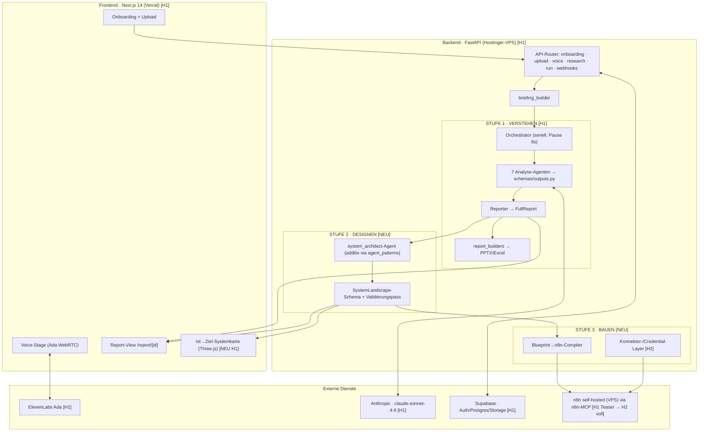
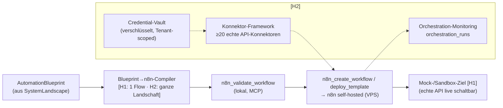

# Solution Architecture — AI-Adoption-Studio

> **Dokument-Typ:** BMAD Solution Architecture (Phase 2 — technisches Lösungsdesign)
> **Projekt:** AI-Adoption-Studio
> **Stand:** 09.06.2026
> **Autor-Kontext:** Alex Heyers · Vibe Coding Bootcamp (Digitale Leute School, Kohorte 05/26)
> **Horizonte:** **H1** = Portfolio-Demo bis Final-Pitch 21.07.2026 · **H2** = BIZ26-SaaS danach
> **Vorgelagert:** `docs/plan/01-product-brief.md`, `docs/plan/02-prd.md`
> **Quellen (real gelesen, nicht geraten):** `api/main.py`, `api/routers/run.py`, `agents/orchestrator.py`, `schemas/outputs.py`, `schemas/briefing.py`, `docs/sdk-architecture.md`, `supabase/migrations/20260509_001_init.sql`, `knowledge/vendor_landscape.yaml`, `config.py`, `requirements.txt`, `docker-compose.yml`, `web/app/*`, `agent_patterns/`

---

## Lese-Konventionen & Abgrenzung

- Jede Architektur-Komponente trägt einen **Horizont-Tag** `[H1]` (real bis 21.07. gebaut) oder `[H2]` (SaaS danach). Wo H1 und H2 dieselbe Komponente unterschiedlich tief bauen, steht `[H1→H2]`.
- **Stufen:** Stufe 1 = VERSTEHEN, Stufe 2 = DESIGNEN, Stufe 3 = BAUEN/ORCHESTRIEREN.
- **Orchestrierungs-Disambiguierung (zwingend):** Wo „Orchestrierung" im Sinne von Stufe 3 auftaucht, ist immer das **Produkt-Feature** gemeint — die Systeme **des Kunden** werden verbunden. Das ist **niemals** die interne Meta-Delivery-Plattform (das Studio baut sich selbst, Linear ALE-44/49/50). Letztere ist für dieses Dokument out of scope.
- **Wort-Disambiguierung „Agent":** „Analyse-Agent" = ein LLM-Agent in der Pipeline (`agents/*.py`). „Voice-Agent Ada" = ElevenLabs-Conversational-AI. „n8n-Agent/Node" = Workflow-Schritt im Orchestrierungs-Layer. Keine zwei davon vermischen.

---

## Architektur-Überblick

Das Studio ist heute ein **Zwei-Tier-System** (Next.js-Frontend ↔ FastAPI-Backend) mit einer seriellen Multi-Agent-Pipeline, Supabase als Daten-/Auth-/Storage-Backbone und ElevenLabs als externem Voice-Layer. Die 3-Stufen-Vision erweitert dieses Fundament **additiv** um zwei neue Backend-Schichten: einen **System-Design-Generator** (Stufe 2) und einen **Build-/Orchestrierungs-Layer** (Stufe 3) mit n8n als ausführendem Hub. Entscheidend: Stufe 2 und 3 hängen sich an die **bereits existierenden Output-Schemas** an (`ToolRecommendation.required_integrations` / `data_flow` als Eingangs-Datensatz) — kein Neubau des Kerns.



**Lese-Hilfe zum Diagramm:** Alles in `[H1]`/`NEU H1` wird bis zum Pitch real gebaut; `[H2]` ist die SaaS-Ausbaustufe. Der grüne Pfad „REP → ARCH → LAND → MAP" ist der Stufe-2-Kern; „LAND → COMP → N8N" ist der Stufe-3-Teaser (in H1 genau **ein** Flow).

---

## Bestehende Architektur Stufe 1 (VERSTEHEN) [H1 — gebaut]

Das ist der reife, lauffähige Kern. Er wird **nicht angefasst**, sondern erweitert.

### Frontend — Next.js 14 (Vercel)
`web/app/` enthält bereits die Demo-relevanten Routen: `onboarding/`, `voice/` (+ `voice-test/`), `report/[id]/`, `dashboard/`, `agents/`, `customer-journey/`, `pitch/`, `login/` + `auth/callback`. Das Frontend spricht das FastAPI-Backend über JWT-authentifizierte Calls an (Supabase-Auth-Token). Die Voice-Stage bindet das ElevenLabs-WebRTC-SDK direkt im Browser ein.

### Backend — FastAPI (Hostinger-VPS)
`api/main.py` mountet sechs Router: `onboarding`, `upload`, `voice`, `research`, `run`, `webhooks`. Der zentrale Produkt-Flow ist `api/routers/run.py`:
1. `POST /run/start` validiert Company-Ownership, baut via `runs/briefing_builder.build_briefing(...)` ein `Briefing` (aus Company + Voice-Transcript + Web-Research),
2. legt einen `runs`-Datensatz (`status=pending`) an,
3. startet die Pipeline als **FastAPI-`BackgroundTask`** — Engine-Wahl per Feature-Flag `USE_SDK_PIPELINE` (`runs/pipeline_runner_sdk` vs. `runs/pipeline_runner`),
4. `GET /run/{id}` liefert Run-Status + aggregierte `run_results`, `GET /run/{id}/download/{fmt}` eine signierte Storage-URL (`xlsx|pptx|pdf`).

### Multi-Agent-Pipeline
`agents/orchestrator.py` (CLI/Test-Pfad) führt **seriell** mit `AGENT_PAUSE_SECONDS` (Default 8s, Anthropic-Tier-1-Rate-Limit) sieben Analyse-Agenten aus: `process_auditor → use_case_generator → tool_recommender → roi_calculator → compliance_checker → roadmap_generator → reporter` (optional vorgelagert `web_research`, `pre_audit_analyst`, `document_analyst`). Modell: `claude-sonnet-4-6`, `MAX_TOKENS=20000` (`config.py`). Jeder Agent gibt ein **Pydantic-validiertes** Output zurück (`schemas/outputs.py`); der `Reporter` aggregiert zu `FullReport`.

**Zwei parallele Ausführungspfade — wichtig für die Erweiterung:**
- **Legacy-Pfad:** roher `anthropic`-Client (`agents/_client.call_agent`), Reihenfolge hartcodiert.
- **SDK-Pfad:** `agent_patterns/` auf Basis `claude-agent-sdk`, **config-driven** (`config/config.yaml`), deklarativer `AgentSpec`, additive Agent-Registrierung in 3 Schritten ohne Core-Eingriff (`docs/sdk-architecture.md` §5). Alle Analyse-Agenten sind bereits in beide Welten gespiegelt; **die Output-Schemas sind identisch** geteilt.

> **Architektur-Konsequenz:** Der neue `system_architect`-Agent (Stufe 2) wird **im SDK-Pfad** als zusätzliches Pattern-Modul registriert. Das ist der Grund, warum Stufe 2 additiv und risikoarm ist — kein Eingriff in den laufenden Legacy-Pfad.

### Daten / Auth / Storage — Supabase
`supabase/migrations/20260509_001_init.sql` definiert: `profiles` (1:1 `auth.users`, Auto-Insert-Trigger), `companies` (owner-scoped), `documents`, `web_research`, `voice_sessions`, `runs`, `run_results` (generisch, `output jsonb`, unique `(run_id, agent_name)`). **RLS ist auf allen Tabellen aktiv**, owner-scoped über `auth.uid()`; das Backend umgeht RLS gezielt über den Service-Role-Key. Files liegen in den Storage-Buckets `documents` und `deliverables`.

### Externe Integrationen Stufe 1
- **Anthropic** (`claude-sonnet-4-6`) — alle Analyse-Agenten.
- **ElevenLabs** — Voice-Agent Ada (`voice/`: `elevenlabs_client.py`, `pre_brief.py`, `master_pool.yaml`, `hypothesis_trees.yaml`, `pool_loader.py`). Ada ist **bewusst NICHT** als Claude-SDK-Agent migriert (`docs/sdk-architecture.md` §7) — sie bleibt eigener Layer.
- **Supabase** — Auth/Postgres/Storage.
- Dokument-Parsing: `pdfplumber`, `openpyxl`, `pandas`, `python-docx`. Report: `python-pptx`, `weasyprint` (PDF ist Stub).

> **Realitäts-Korrektur ggü. Brief:** `docker-compose.yml` enthält nur `api` + `web` — **n8n läuft nicht im Compose**, sondern als **externe** self-hosted Instanz auf dem VPS, angesprochen über den n8n-MCP-Server. Das ist für Stufe 3 die korrekte Annahme (kein neuer Container im App-Stack nötig).

---

## NEU: Architektur Stufe 2 „System-Design-Generator" (DESIGNEN)

Stufe 2 ist **kein neues System**, sondern ein **Verdichter**: Sie liest die bereits erzeugten Stufe-1-Outputs und macht aus flachen Empfehlungs-Feldern einen **kohärenten, validierten Graphen** — den Sprung von „Tool-Liste" zu „verbundener Ziel-Systemlandschaft". Der verkaufsstärkste Teil ist das **Ist→Ziel-Delta**, das fast geschenkt aus vorhandenen Daten kommt.

### Daten-in/Daten-out (worauf Stufe 2 andockt)

| Quelle (existiert) | Feld | Verwendung in Stufe 2 |
|---|---|---|
| `ProcessAuditOutput.processes[].touchpoints[]` | `system`, `role`, `integration_status` ∈ {isolated, manual-sync, api-integrated, unknown} | **Ist-Graph**: Knoten = heutige Systeme, Kanten-Status aus `integration_status` |
| `Process.current_tools[]` (`CurrentToolInUse`) | `category`, `vendor_or_brand`, `is_paper_or_excel`, `monthly_cost_eur` | Ist-Knoten anreichern (Marke, Kosten, „noch analog") |
| `ToolRecommendationOutput.recommendations[]` | `required_integrations[]`, `data_flow`, `integration_with_existing`, `compliance` (`VendorComplianceBlock`) | **Ziel-Graph**: Ziel-Knoten + Kanten-Kandidaten + EU-Hosting/AVV-Flags |
| `UseCaseOutput.use_cases[]` | `name`, `ai_pattern`, `target_process` | Mapping `automations[]` ↔ Use-Cases (1:1) |
| `knowledge/vendor_landscape.yaml` | iPaaS-Block (n8n self-hosted, Make, Zapier; Z. 238–253) | Konnektor-Wissen: welcher `mechanism` realistisch ist |

### Neues Output-Schema: `SystemLandscape` (`schemas/system_design.py` — neu)

Maschinenlesbares Architektur-Artefakt. Pydantic, analog zu `schemas/outputs.py`, **im selben Modul-Stil** (`Literal`-Enums, `Field`-Descriptions):

```text
SystemLandscapeNode
  id, name, category, tier, vendor, eu_hosting: bool|None,
  monthly_cost_eur: int|None,
  status: Literal["keep","add","replace","retire"],
  layer: Literal["datenquelle","orchestrierung","aktion","analytik"],
  source_ref: str          # Herkunft: Audit-Touchpoint vs. Tool-Recommendation

SystemLandscapeEdge
  from_id, to_id,
  mechanism: Literal["native-API","webhook","iPaaS-n8n","file-export","manual"],
  data_objects: list[str], direction: Literal["push","pull","bidi"],
  frequency: Literal["realtime","near-realtime","batch","ad-hoc"],
  dsgvo_personal_data: bool, integrity_status: Literal["ok","gap","unverified"]

AutomationBlueprint            # Stufe-2-Bindeglied zu Stufe 3
  id, name, mapped_use_case,
  trigger: str, steps: list[str], outcome: str,
  owner: str,                  # Pflicht (Integritäts-Guardrail)
  buildable_now: bool          # markiert den/die H1-Teaser-Flow(s)

SystemLandscape
  nodes: list[SystemLandscapeNode]
  edges: list[SystemLandscapeEdge]
  automations: list[AutomationBlueprint]
  layers: dict                 # Layer→Knoten-Zuordnung (Rendering-Hilfe)
  validation_findings: list[str]   # offene Lücken, NICHT verschwiegen
  narrative: str               # Trevor-Noah-Voice Kurz-Erzählung „Ist→Ziel"
```

### Neuer Agent: `system_architect` (additiv via `agent_patterns`)

Registrierung exakt nach `docs/sdk-architecture.md` §5 (3 Schritte, kein Core-Eingriff):
1. `agent_patterns/patterns/ai_adoption/system_architect.py` mit `build(context) -> AgentSpec`, `output_model=SystemLandscape`.
2. Eintrag in `patterns/ai_adoption/__init__.py · REGISTRY`.
3. `sequence`-Eintrag in `config/config.yaml` (nach `reporter`, `enabled: true`).

**Aufgabe des Agenten** (FR-20): Ist- und Ziel-Graph zu einem kohärenten `SystemLandscape` verdichten; **Integrations-Konflikte auflösen** (z.B. zwei empfohlene PMS → einer gewinnt, der andere `status=retire`); **fehlende Konnektoren als Lücke markieren** („Tool A braucht Datenobjekt X, keine Quelle liefert X" → `validation_findings`). Der Agent konsumiert den fertigen `FullReport` aus dem `context` (Reporter-Output liegt unter seinem `name` bereit).

### Integritäts-Validierungspass (FR-21, analog VUFVE)

Ein **deterministischer Python-Pass** (kein LLM) prüft nach dem Agent-Lauf jede Kante/Automation:
- Jede `edge.mechanism` ≠ „magisch verbunden" → sonst `integrity_status="gap"` + Finding.
- Jeder geforderte `data_object` hat eine Quelle (ein Knoten mit `direction=push/bidi` als Lieferant) → sonst Finding.
- Jede `automation.owner` ist gesetzt → sonst Finding.
- Jede Kante mit `dsgvo_personal_data=true` muss zu einem Ziel-Knoten mit bekanntem `eu_hosting` führen (NFR-2).

Verletzungen werden **ausgewiesen, nicht verschwiegen** — das ist die Senior-Qualitäts- und No-Fake-Garantie (NFR-8) und schützt den Pitch.

### Tool-/Integrations-Katalog-Konzept (Stufe-2-Wissensbasis)

Der `mechanism` einer Kante darf nicht halluziniert werden. Quelle ist ein **deklarativer Integrations-Katalog** (`knowledge/integration_catalog.yaml` — neu, additiv zur bestehenden Knowledge-Familie), der pro Vendor/Kategorie bekannte Schnittstellen führt: `native-API?`, `webhook?`, `n8n-Node verfügbar?`, `file-export-Format`. Gespeist aus dem bereits vorhandenen `vendor_landscape.yaml` (iPaaS-Block) + `hospitality_tools_db.yaml`. So bleibt der Graph **belegbar**: jede Kante referenziert einen Katalog-Eintrag oder fällt auf `mechanism="manual"` + Finding zurück.

### Visualisierung — Ist→Ziel-Systemkarte [NEU H1]

Reuse der bestehenden Three.js-Galaxie (`System-Map/claude-system-galaxie.html`, Memory `[[project_system_map_3d]]`). Variante als Next.js-Page (`web/app/system-map/` oder Integration in `report/[id]`): **links Ist** (isolierte Inseln, `isolated`/`manual-sync` visuell rot), **rechts Ziel** (verbundene Knoten, n8n als Orchestrierungs-Hub). Datenquelle: das `SystemLandscape`-JSON. Akzeptanz: in <10 Sek als „aus Bedürfnissen wird Struktur" lesbar (FR-22/AC-3). **OQ-6** (eigene Page vs. in Next.js integriert) bleibt Alex' Entscheidung.

### Report-Integration

`FullReport` bekommt ein optionales Feld `system_landscape: SystemLandscape | None`; die Report-Builder (`report_builders/`) erhalten eine neue Sektion „Eure Ziel-Systemlandschaft" (PPTX-Slide + Web-Sektion). In H1 reicht **JSONB-Persistenz** im bestehenden `run_results`-Muster (`agent_name="system_architect"`) — dedizierte Tabellen sind H2 (siehe unten, FR-25).

---

## NEU: Architektur Stufe 3 „Build-/Orchestrierungs-Layer" (BAUEN)

Stufe 3 macht aus dem Blueprint **ausführende Realität**. Der glaubwürdige Hebel ist **n8n als Orchestrierungs-Hub** (Alex' Kernkompetenz, self-hosted auf dem VPS, angesprochen über den n8n-MCP-Server mit 525-Node-Coverage: `n8n_create_workflow`, `n8n_validate_workflow`, `n8n_deploy_template`).

> **H1-Scope-Cut (hart):** In H1 wird **genau eine** `AutomationBlueprint` (mit `buildable_now=true`, z.B. „Reservierungs-Mail → PMS-Eintrag") real kompiliert, validiert und gegen **Mock/Sandbox** deployt (FR-27/FR-28, AC-4). Kein Voll-Compiler, keine Konnektor-Bibliothek, kein Credential-Vault — das ist H2.

### Komponenten



### (a) Blueprint-Layer — `Blueprint→n8n-Compiler`
Eigenes Backend-Modul (`builders/n8n_compiler.py` — neu). Input: eine `AutomationBlueprint`. Output: **valides n8n-Workflow-JSON** (Trigger-Node + Aktions-Nodes + Mapping). **H1:** ein deterministischer Generator für genau das eine Teaser-Pattern, parametrisiert aus dem Blueprint (kein generischer Voll-Compiler — FR-24/FR-29-Grenze). **H2:** generisch über `automations[]` einer **ganzen** Landschaft (FR-29/FR-32).

### (b) Orchestrierungs-Layer — n8n via MCP
Der Compiler-Output geht durch `n8n_validate_workflow` (lokale Validierung, kein Fehler = Gate) und wird per `n8n_create_workflow` auf die VPS-n8n-Instanz deployt. **A2 ist vor dem Teaser end-to-end smoke-zutesten** (PRD-Annahme) — wenn die MCP-VPS-Anbindung aus der Demo-Umgebung nicht trägt, fällt der Teaser auf eine lokale n8n-Sandbox zurück (Risiko R2 dokumentiert, nicht stillschweigend angenommen).

### (c) Konnektor-/Credential-Layer [H2]
- **Konnektor-Framework** (FR-30): ≥20 echte API-Konnektoren, jeweils Mapping `data_object ↔ API-Endpoint`.
- **Credential-Vault** (FR-30, NFR-7): verschlüsselt, Tenant-scoped, neue Tabelle `connector_credentials`. Service-Role-Zugriff backend-seitig, nie im Frontend.

### Provisioning & Guardrails
- **Provisioning** (H2): aus einer freigegebenen Landschaft werden Workflows als **Bündel** deployt (FR-32), Status in `orchestration_runs` (FR-31).
- **Guardrails (H1 schon aktiv):**
  - Nur Automationen mit `buildable_now=true` UND bestandenem Integritäts-Pass dürfen kompiliert werden.
  - Jeder deployte Flow ist im UI/Pitch **ehrlich gerahmt** („gegen echte API live schaltbar", nie „produktiv fertig" — FR-28, NFR-8).
  - n8n-MCP `n8n_validate_workflow` ist ein **harter Gate** vor jedem Deploy.
  - Pre-Deploy-grep (NFR-9): kein „BIZ26"/„KI-Boutique"/„Münster", echte Umlaute — auch im generierten Workflow-JSON.

---

## Datenmodell-Erweiterungen (Supabase)

Bestehend (unverändert): `profiles`, `companies`, `documents`, `web_research`, `voice_sessions`, `runs`, `run_results`. Alle RLS-an, owner-scoped via `auth.uid()`.

### H1 — minimal-invasiv (kein Migrations-Risiko vor dem Pitch)
- **Keine** neuen Tabellen nötig. Das `SystemLandscape` wird als zusätzliche `run_results`-Zeile persistiert (`agent_name="system_architect"`, `output=<SystemLandscape-JSON>`) — die `unique (run_id, agent_name)`-Constraint und die bestehende RLS-Policy gelten automatisch. Das ist der bewusste **JSONB-First**-Cut aus PRD OQ-3 (KANN-Liste).

### H2 — dedizierte, versionierte Tabellen (neue Migration `2026xxxx_005_system_design.sql`)
| Tabelle | Zweck | FR |
|---|---|---|
| `system_landscapes` | versioniert pro Run, **immutable** (Muster wie `runs`/`run_results`); `run_id`, `version`, `narrative`, `validation_findings jsonb` | FR-25/26 |
| `landscape_nodes` | Knoten je Landschaft (`status`, `layer`, `eu_hosting`, `cost`) | FR-25 |
| `landscape_edges` | Kanten je Landschaft (`mechanism`, `data_objects`, `dsgvo_personal_data`, `integrity_status`) | FR-25 |
| `automation_blueprints` | Automationen je Landschaft (`trigger`, `steps`, `owner`, `buildable_now`, `mapped_use_case`) | FR-25 |
| `connector_credentials` | **verschlüsselt**, Tenant-scoped — Secrets der Stufe-3-Konnektoren | FR-30, NFR-7/12 |
| `orchestration_runs` | Status real deployter Flows (Monitoring) | FR-31 |

**RLS:** alle erben das bestehende owner-scoped-Muster (Join über `runs → companies.owner_id`, exakt wie `run_results`-Policy). In H2 wird `owner_id` um eine echte **Tenant-Namespace-Spalte** ergänzt (FR-35) und die Policies entsprechend erweitert; `connector_credentials`-Zugriffe werden auditierbar protokolliert (NFR-12).

---

## Externe Integrationen & Tool-Katalog-Konzept

| Dienst | Rolle | Horizont | Anbindung |
|---|---|---|---|
| **Anthropic** (`claude-sonnet-4-6`) | alle LLM-Agenten inkl. `system_architect` | [H1] | `anthropic`-Client (Legacy) bzw. `claude-agent-sdk` (SDK-Pfad) |
| **ElevenLabs** | Voice-Agent Ada | [H1] | WebRTC-SDK (Browser) + `voice/elevenlabs_client.py` |
| **Supabase** | Auth/Postgres/Storage | [H1] | `supabase-py` (Service-Role backend, Anon-JWT frontend) |
| **n8n self-hosted (VPS)** | Stufe-3-Orchestrierung | [H1 Teaser → H2 voll] | **n8n-MCP** (`n8n_validate_workflow`, `n8n_create_workflow`, `n8n_deploy_template`) — **extern**, nicht im docker-compose |
| **Anthropic Web-Search** | Web-Research-Agent | [H1] | im SDK-Tool-Layer (`allowed_tools=["WebSearch"]`) |
| Echte Vendor-APIs (PMS/HubSpot/DATEV …) | Stufe-3-Konnektoren | [H2] | Konnektor-Framework + Vault |

**Tool-Katalog-Konzept (zwei Ebenen, nicht verwechseln):**
1. **Empfehlungs-Wissen (Stufe 1/2):** `knowledge/vendor_landscape.yaml` + `hospitality_tools_db.yaml` — *was* empfohlen wird, inkl. EU-Hosting/AVV/Preise.
2. **Integrations-Wissen (Stufe 2/3, neu):** `knowledge/integration_catalog.yaml` — *wie* zwei Systeme verbunden werden können (native-API / webhook / n8n-Node / file-export). Dieser Katalog ist die **Wahrheitsquelle für jede Kanten-`mechanism`** und damit das Fundament des Integritäts-Guardrails.

---

## Mandantenfähigkeit / Security (H2)

- **H1 — owner-scoped per RLS:** Datenisolation läuft heute über `auth.uid() = owner_id` auf allen Tabellen (FR-33, NFR-1 Basis). Für die Single-Run-Demo ausreichend; kein Tenant sieht fremde Daten.
- **H2 — echte Tenant-Isolation:** Tenant-Slug/Namespace-Spalte zusätzlich zu `owner_id` (FR-35); RLS-Policies um Tenant-Scope erweitert; Cross-Tenant-Zugriff technisch ausgeschlossen + **auditierbar protokolliert** (NFR-12, AC-7).
- **Credentials/Secrets (NFR-7):** API-Keys ausschließlich aus `.env` (siehe `config.py`, hartes `RuntimeError` bei fehlendem Key) — nie im Repo. Service-Role-Key umgeht RLS **nur** backend-seitig. Stufe-3-Konnektor-Credentials in H2 verschlüsselt + Tenant-scoped (`connector_credentials`).
- **DSGVO/AI-Act (NFR-2/3):** EU-Hosting für Firmendaten möglich; `VendorComplianceBlock.eu_hosting`/`avv_available` im Schema; jede Stufe-2-Kante mit personenbezogenen Datenflüssen trägt `dsgvo_personal_data`; AI-Act-Risikoklasse je Use-Case/Empfehlung; Disclaimer „ersetzt keine Rechtsberatung" bleibt.
- **Leitplanken (NFR-9):** Pre-Deploy-grep auf „BIZ26"/„KI-Boutique"/„Münster"/falsche Umlaute — Pflicht-Gate vor jedem Deploy, auch auf generiertes n8n-JSON.

---

## Technologie-Entscheidungen + Begründung

| Entscheidung | Begründung | Horizont |
|---|---|---|
| **`system_architect` additiv via `agent_patterns` (SDK-Pfad)**, nicht im Legacy-Orchestrator | 3-Schritt-Registrierung ohne Core-Eingriff (`docs/sdk-architecture.md` §5); Output-Schemas geteilt → 1:1 Reporter-kompatibel; Legacy-Live-Pfad bleibt unberührt (Risiko-Minimierung vor Pitch) | [H1] |
| **Neues `SystemLandscape`-Schema** statt Wiederverwendung von `RoadmapOutput` | Roadmap liefert nur Phasen/PT, **keinen** verbundenen Graphen; ein Graph (nodes/edges/automations) ist domänenfrei und damit die saubere Branchenagnostik-Achse | [H1] |
| **Deterministischer Integritäts-Pass (Python, kein LLM)** zusätzlich zum Agent | Halluzinierte Verbindungen sind das größte Pitch-Risiko (NFR-8); ein regelbasierter Pass ist reproduzierbar und beweisbar, ein LLM nicht | [H1] |
| **n8n als Orchestrierungs-Hub via MCP** statt Eigenbau-Konnektoren | Alex' dokumentierte Kernkompetenz + 525-Node-MCP-Coverage + self-hosted EU-Hosting (`vendor_landscape.yaml`) → „bauen" ist vorzeigbar, nicht Vaporware | [H1→H2] |
| **n8n extern (VPS), nicht im docker-compose** | Compose enthält real nur `api`+`web`; n8n ist bestehende VPS-Infra — kein neuer App-Container, geringere Demo-Komplexität | [H1] |
| **JSONB-First-Persistenz für `SystemLandscape` in H1** (`run_results`) | Nutzt bestehende Tabelle + RLS + Unique-Constraint; keine riskante Migration vor dem Pitch; dedizierte Tabellen sind H2 | [H1] |
| **`claude-sonnet-4-6` beibehalten** (`config.py`) | bereits im Tier-1-Budget kalibriert (`MAX_TOKENS=20000`, 8s-Pause); kein Modellwechsel-Risiko in H1 | [H1] |
| **`integration_catalog.yaml` als eigene Knowledge-Datei** | trennt *was* (Empfehlung) von *wie* (Mechanismus); macht jede Kante belegbar; additiv zur bestehenden Knowledge-Familie | [H1] |
| **Celery/Redis erst in H2** (heute FastAPI-`BackgroundTasks`) | H1 läuft bewusst single-run (NFR-4); Concurrency-Hardening erst bei zahlenden Tenants (NFR-5) | [H2] |
| **Ada bleibt eigener ElevenLabs-Layer**, nicht SDK-migriert | kein Claude-SDK-Agent; bewusste Grenze (`docs/sdk-architecture.md` §7) | [H1] |

---

## Was H1 real baut vs. H2

| Schicht | **H1 — real bis 21.07.** | **H2 — SaaS danach** |
|---|---|---|
| **Stufe 1 (Verstehen)** | voll lauffähig gegen Mock-Hotel (7 Agenten + Ada + PPTX/Excel) — bereits gebaut, wird poliert | echte Kundendaten, Re-Run/Versionierung, Celery/Redis |
| **Stufe 2 (Designen)** | `SystemLandscape`-Schema + `system_architect`-Agent + Integritäts-Pass + `integration_catalog.yaml` + Ist→Ziel-Three.js-Karte + Report-Sektion; Persistenz als JSONB in `run_results` | dedizierte versionierte Tabellen (FR-25), Re-Design-Loop (FR-26) |
| **Stufe 3 (Bauen)** | **genau 1** `AutomationBlueprint` → `n8n_compiler` → `n8n_validate_workflow` → Deploy gegen Mock/Sandbox; ehrlich gerahmt | Voll-Compiler (FR-29), Konnektor-Bibliothek ≥20 + Vault (FR-30), Monitoring (FR-31), ganze Landschaft deployen (FR-32) |
| **Datenmodell** | keine neue Migration (JSONB-First) | `system_landscapes`/`landscape_nodes`/`landscape_edges`/`automation_blueprints`/`connector_credentials`/`orchestration_runs` |
| **Mandanten/Security** | `owner_id`/RLS (Single-Run-Demo) | Tenant-Namespace (FR-35), Credential-Vault, Audit-Log (NFR-12), Billing (FR-36) |
| **Branchen** | Hospitality tief (Hotel = Fall 1) | branchenagnostisch via neues Vendor-Pack + Fragepool (`agent_patterns/patterns/<domain>/`), ≥2. Branche (FR-34/37) — Generator bleibt |
| **Integrationen** | n8n-MCP-Teaser gegen Sandbox | echte Live-API-Connects (PMS/HubSpot/DATEV/GA4) |

**Architektur-Leitsatz für H1:** *Additiv, nicht invasiv.* Der gesamte Stufe-2/3-Aufbau hängt sich an bestehende Schemas, den SDK-Agent-Pfad und externe VPS-n8n-Infra — der laufende Stufe-1-Kern bleibt unberührt. Das ist die Voraussetzung dafür, die volle 3-Stufen-Story bis 21.07. lauffähig und ehrlich zu zeigen, ohne den funktionierenden Teil zu gefährden.

---

## Offene Architektur-Entscheidungen (von Alex zu treffen)

- **AO-1 [H1]:** Ist→Ziel-Karte als eigenständige `System-Map/`-Page (HTML, schnell) **oder** in die Next.js-App (`web/app/system-map/`) integriert? (PRD OQ-6) — Empfehlung: eigenständige Page für H1 (Reuse > Integration), Integration in H2.
- **AO-2 [H1]:** Stufe-3-Teaser gegen **Mock-PMS** (volle Kontrolle) oder **echten Sandbox-Account** (höhere Glaubwürdigkeit)? (PRD OQ-2, A2/A3) — vor E5 end-to-end smoke-testen.
- **AO-3 [H1]:** Läuft `system_architect` im **SDK-Pfad** (additiv, sauber) oder pragmatisch im Legacy-`agents/`-Stil wie die anderen 7? — A1 verifizieren; bei SDK-Reibung Legacy als Fallback.
- **AO-4 [H1/H2]:** `automations[]` strikt deklarativ (H1) oder zweites, Compiler-vorbereitendes Schema-Feld schon in H1 ergänzen? (PRD OQ-4) — Empfehlung: deklarativ + `buildable_now`-Flag reichen für H1.
- **AO-5 [H1]:** `integration_catalog.yaml` von Hand kuratiert (klein, belegbar) oder aus `hospitality_tools_db.yaml` (490 KB) generiert? — Empfehlung: handkuratiert für die Demo-Vendoren, Generierung H2.
- **AO-6 [H2]:** Erste zweite Branche für den Agnostik-Nachweis — Retail oder Healthcare? (PRD OQ-5)
