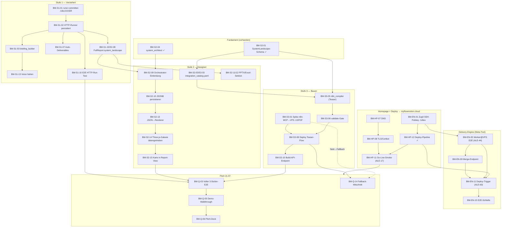

# 07 — Build-Map: Was wird wo wie gebaut

> **Dokument-Typ:** Bau-Übersicht (Synthese der 6 Cluster-Dekompositionen)
> **Erzeugt:** 2026-06-09 · gegen den realen Code im Worktree `ai-adoption-studio-auto` (main) verifiziert
> **Produkt:** 3-Stufen-Plattform — **Stufe 1 Verstehen** · **Stufe 2 Systemlandschaft designen** · **Stufe 3 bauen/orchestrieren**
> **Horizonte:** **H1** = Portfolio-Demo bis Final-Pitch 21.07.2026 → lauffähige URL auf `myflowmotion.cloud` · **H2** = kommerzielles SaaS-Produkt danach

---

## 1. Überblick + Lesart

Diese Datei ist die operative Zusammenführung der sechs Cluster-Dekompositionen (Stufe 1, Stufe 2, Stufe 3, Delivery-Engine, Homepage/Deployment, Querschnitt) in **eine** Bau-Übersicht. Sie beantwortet für jede Story: **was** (1–2 Sätze), **wo** (konkrete Dateien/Module), **wie** (Ansatz), **hängt-von** (andere Stories/ALE-IDs), **Horizont** (H1/H2), **Stufe** (1/2/3/Engine/Querschnitt), **Size** (S/M/L), **Status** (neu/teilweise/vorhanden).

**Statt-Legende (gegen realen Code verifiziert):**
- **vorhanden** = Code existiert und ist im Repo verdrahtet (z.B. `schemas/system_landscape.py`, `agents/system_architect.py`, `web/components/*`).
- **teilweise** = Bausteine existieren, aber Verdrahtung/Härtung fehlt (z.B. Voice-Flow gebaut, Transcript-Pull mit Platzhalter).
- **neu** = existiert nicht im Repo (z.B. `builders/`, `runs/`, `knowledge/integration_catalog.yaml`, Migration 005/006).

**Wichtigste verifizierte Wahrheiten (Stand 2026-06-09):**
1. **`runs/` fehlt komplett** (`.gitignore` Zeile 12 = `runs/`). `api/routers/run.py` importiert zur Laufzeit `runs.briefing_builder` (Z.89) und `runs.pipeline_runner` bzw. `runs.pipeline_runner_sdk` (Z.113/115). → **`/run/start` crasht aus frischem Checkout. End-to-End-H1 ist aktuell NICHT lauffähig.** Das ist der #1-Blocker.
2. **`builders/` und `connectors/` existieren nicht** — der gesamte Stufe-3-Build-Layer ist Greenfield.
3. **`knowledge/integration_catalog.yaml` existiert nicht** (vorhanden: `vendor_landscape.yaml`, `hospitality_tools_db.yaml` u.a.).
4. **`outputs/`-Paket ist leer** (nur `__pycache__`). `test_pipeline.py` (Z.73–75) importiert `outputs.excel_generator/pptx_generator/pdf_generator` — real existiert nur `report_builders/` mit `build_excel`/`build_pptx` (kein PDF-Generator). → CLI-Deliverable-Pfad crasht.
5. **`FullReport` hat KEIN `system_landscape`-Feld** (`schemas/outputs.py`) → Stufe-1→2-Brücke fehlt.
6. **`agent_patterns/patterns/ai_adoption/` existiert**, enthält aber **keinen `system_architect.py`** → Stufe 2 ist nicht im SDK-Pattern registriert.
7. **nginx-Confs sind reines Port-80** (`deploy/nginx-myflowmotion.conf` Z.6, `deploy/nginx-api.conf` Z.5) → **TLS fehlt komplett.**
8. **Kein `.github/`-Verzeichnis** → keine CI.
9. Migrationen: nur `001_init`, `002_storage`, `003_deliverables_bucket`, `004_explicit_grants` — **kein 005/006**.

**Linear-Hinweis (ehrlich):** Der reale Stand laut `04-epics-and-stories.md` Z.9 ist **50 Issues (ALE-1…ALE-50)**, Milestones P1–P5 (+ vorgeschlagen P6/P7). Der Auftrags-Kontext nennt „ALE-1..60". Die IDs **ALE-58/59/60** tauchen nur in der Delivery-Engine-Dekomposition als Issue-Vorschläge auf und sind im Epics-Doc nicht belegt — sie werden unten als „anzulegen/zu verifizieren" markiert, nicht als gesichert bestehend.

---

## 2. Master-Tabelle aller Stories

> ID-Vorschlag-Schema: `BM-S1-xx` (Stufe 1), `BM-S2-xx` (Stufe 2), `BM-S3-xx` (Stufe 3), `BM-EN-xx` (Delivery-Engine), `BM-HP-xx` (Homepage/Deploy), `BM-Q-xx` (Querschnitt). „ALE-" in der hängt-von-Spalte verweist auf bestehende Linear-Issues.

| ID | Story (Kurz) | Hor. | Stufe | Size | Status | Datei/Modul | hängt-von |
|----|--------------|------|-------|------|--------|-------------|-----------|
| BM-S1-01 | `runs/`-Paket committen + gitignore-Falle beheben | H1 | 1 | L | neu | `.gitignore:12`, `runs/__init__.py`, `runs/pipeline_runner.py`, `runs/briefing_builder.py` | — |
| BM-S1-02 | HTTP-Runner persistiert alle 7 Agent-Outputs (FR-14) | H1 | 1 | M | teilweise | `runs/pipeline_runner.py`, `agents/_supabase.py`, `api/routers/run.py:97-118` | BM-S1-01 |
| BM-S1-03 | briefing_builder: Company+Voice+Web-Research konsolidieren (FR-6) | H1 | 1 | M | teilweise | `runs/briefing_builder.py`, `schemas/briefing.py`, `api/routers/run.py:89-95` | BM-S1-01 |
| BM-S1-04 | SDK-Runner bereitstellen oder USE_SDK_PIPELINE entschärfen | H1 | Engine | M | neu | `runs/pipeline_runner_sdk.py`, `api/routers/run.py:111-116`, `agent_patterns/core/orchestrator.py` | BM-S1-02 |
| BM-S1-05 | document_analyst in Pipeline einhängen (FR-16) | H1 | 1 | M | teilweise | `agents/document_analyst.py`, `agents/orchestrator.py`, `runs/pipeline_runner.py`, `schemas/outputs.py` | BM-S1-02 |
| BM-S1-06 | Web-Research deterministisch in Run-Flow (FR-3, ALE-19) | H1 | 1 | M | teilweise | `agents/web_research.py`, `api/routers/research.py`, `runs/briefing_builder.py`, `web/app/voice/page.tsx:48` | BM-S1-03 |
| BM-S1-07 | Auto-Deliverable-Generierung nach Run-Ende (FR-13) | H1 | 1 | S | teilweise | `api/routers/run.py:137,167`, `report_builders/*`, `runs/pipeline_runner.py`, `web/app/report/[id]/page.tsx:1320` | BM-S1-02 |
| BM-S1-08 | CLI-Smoke-Test reparieren: `outputs/`-Mismatch (FR-15) | H1 | 1 | S | teilweise | `test_pipeline.py:73-89`, `report_builders/__init__.py` | — |
| BM-S1-09 | PDF-Generator ergänzen ODER PDF-Format streichen | H1 | 1 | S | neu | `report_builders/` (kein pdf_generator), `api/routers/run.py:170`, `web/app/report/[id]/page.tsx` | BM-S1-07 |
| BM-S1-10 | E2E-Smoke um HTTP-Run-Pfad erweitern (ALE-37) | H1 | Querschnitt | M | teilweise | `test_pipeline.py`, `api/routers/run.py`, `runs/*` | BM-S1-02, BM-S1-03 |
| BM-S1-11 | Briefing-Confirmation-Page verdrahten (ALE-12) | H1 | 1 | M | teilweise | `web/app/picker/page.tsx` (≠Confirmation), `web/app/onboarding/page.tsx`, `api/routers/onboarding.py` | — |
| BM-S1-12 | Resend-Magic-Link / Email-Service (ALE-14) | H1 | Querschnitt | M | neu | `web/app/login/page.tsx:33`, `api/` (kein email-Modul) | — |
| BM-S1-13 | Voice-Intake härten: Transcript-Persistenz (ALE-24/26, FR-5) | H1 | 1 | M | teilweise | `web/app/voice/page.tsx:84-112`, `api/routers/voice.py:119`, `api/routers/webhooks.py`, `voice/elevenlabs_client.py` | BM-S1-03 |
| BM-S1-14 | ElevenLabs-Agent „Ada" Production-Config (ALE-21) | H1 | 1 | M | teilweise | `voice/elevenlabs_client.py`, `web/app/voice/page.tsx:268-274`, `.env` | BM-S1-13 |
| BM-S1-15 | FullReport.system_landscape-Feld + Reporter-Aufnahme | H1 | 1 | S | teilweise | `schemas/outputs.py:298`, `agents/reporter.py:52`, `schemas/system_landscape.py` | BM-S1-02 |
| BM-S1-16 | Demo-Datensatz härten: `mock_data/demo_hotel.json` (FR-15) | H1 | 1 | S | teilweise | `mock_data/demo_hotel.json`, `mock_data/demo_hotel_report.json`, `schemas/briefing.py` | BM-S1-08 |
| BM-S2-01 | SystemLandscape-Schema (nodes/connections/automations) | H1 | 2 | M | **vorhanden** | `schemas/system_landscape.py` | — |
| BM-S2-02 | Integritäts-Pass: DSGVO/eu_hosting + owner-Regeln (FR-21) | H1 | 2 | S | teilweise | `schemas/system_landscape.py` | BM-S2-01 |
| BM-S2-03 | `knowledge/integration_catalog.yaml` als Mechanismus-Wahrheit | H1 | 2 | M | neu | `knowledge/integration_catalog.yaml`, `knowledge/__init__.py` | BM-S2-01 |
| BM-S2-04 | system_architect-Agent (deterministisch + use_llm) | H1 | 2 | L | **vorhanden** | `agents/system_architect.py` | BM-S2-01 |
| BM-S2-05 | use_llm-Pfad scharfstellen (Mapping + Qualitäts-Gate) | H1 | 2 | M | teilweise | `agents/system_architect.py` (run() LLM-Zweig) | BM-S2-04, BM-S2-03 |
| BM-S2-06 | Integritäts-Pass nach Lauf anwenden (FR-21-Garantie) | H1 | 2 | S | neu | `agents/system_architect.py` (Ende von run()) | BM-S2-04, BM-S2-02 |
| BM-S2-07 | system_architect im SDK-Pattern registrieren | H1 | 2 | M | neu | `agent_patterns/patterns/ai_adoption/system_architect.py`, `.../__init__.py`, `agent_patterns/config/config.yaml` | BM-S2-04 |
| BM-S2-08 | FullReport.system_landscape + Reporter-Aggregation | H1 | 2 | S | neu | `schemas/outputs.py`, `agents/reporter.py` | BM-S2-01 |
| BM-S2-09 | Orchestrator-Einbindung: system_architect (CLI + HTTP) | H1 | 2 | M | neu | `agents/orchestrator.py`, `runs/pipeline_runner.py`, `api/routers/run.py` | BM-S2-04, BM-S2-08 |
| BM-S2-10 | SystemLandscape als JSONB in run_results persistieren | H1 | 2 | S | neu | `runs/pipeline_runner.py`, `agents/_supabase.py`, run_results-Tabelle | BM-S2-09 |
| BM-S2-11 | PPTX-Report-Sektion „Eure Ziel-Systemlandschaft" | H1 | 2 | M | neu | `report_builders/pptx_generator.py` | BM-S2-08 |
| BM-S2-12 | Excel-Report-Sektion SystemLandscape | H1 | 2 | M | neu | `report_builders/excel_generator.py` | BM-S2-08 |
| BM-S2-13 | Systemkarte: SystemLandscape-JSON → Renderer-Format | H1 | 2 | M | neu | `report_builders/landscape_map_data.py`, `../System-Map/claude-system-galaxie.html` | BM-S2-04, BM-S2-10 |
| BM-S2-14 | Ist→Ziel-Systemkarte: Three.js-Galaxie datengetrieben (FR-22) | H1 | 2 | L | neu | `../System-Map/claude-system-galaxie.html` bzw. `web/app/system-map/` | BM-S2-13 |
| BM-S2-15 | Systemkarte + Gaps in Report-View einbinden | H1 | 2 | M | neu | `web/app/report/[id]/`, run_results-JSONB | BM-S2-14, BM-S2-10 |
| BM-S2-16 | Tests: Schema, Integritäts-Pass, system_architect-Kern | H1 | 2 | S | neu | `tests/test_system_landscape.py`, `tests/test_system_architect.py` | BM-S2-01, BM-S2-04 |
| BM-S2-17 | H2: Versionierte dedizierte Tabellen (Migration 005) | H2 | 2 | L | neu | `supabase/migrations/2026xxxx_005_system_design.sql` | BM-S2-10 |
| BM-S2-18 | H2: Re-Design-Loop & Versions-Diff (FR-26) | H2 | 2 | L | neu | system_architect-Re-Run + diff-Modul, `web/app/report/[id]/` | BM-S2-17 |
| BM-S3-01 | Spike: n8n-MCP→VPS E2E-Smoke (Annahme A2 / D1) | H1 | 3 | S | neu | n8n-czlonkowski MCP, VPS srv1405308, `docs/plan/05-…md` | — |
| BM-S3-02 | Entscheidung+Setup: Mock-PMS vs. Sandbox-Account | H1 | 3 | S | neu | `mock_data/mock_pms/`, `.env.example`, Architektur AO-2 | BM-S3-01 |
| BM-S3-03 | Kuratierter `integration_catalog.yaml` (Demo-Vendoren) | H1 | 3 | M | neu | `knowledge/integration_catalog.yaml` | — (= BM-S2-03, geteilt) |
| BM-S3-04 | Build-Guardrail: buildable_now + Integritäts-Pass | H1 | 3 | S | neu | `builders/guardrails.py` / `builders/n8n_compiler.py` | BM-S3-03 |
| BM-S3-05 | `builders/n8n_compiler.py` — Blueprint→n8n-JSON (1 Teaser) | H1 | 3 | L | neu | `builders/n8n_compiler.py`, `builders/__init__.py` | BM-S3-04, BM-S3-03 |
| BM-S3-06 | Validierungs-Gate: n8n_validate_workflow hart vor Deploy | H1 | 3 | S | neu | `builders/n8n_compiler.py` / `builders/deploy.py`, n8n-MCP | BM-S3-05 |
| BM-S3-07 | Pre-Deploy-grep auf generiertem n8n-JSON (NFR-9) | H1 | 3 | S | neu | `builders/guardrails.py` / `builders/deploy.py` | BM-S3-05 |
| BM-S3-08 | Deploy Teaser-Flow via n8n-MCP gegen Mock/Sandbox + Fallback | H1 | 3 | M | neu | `builders/deploy.py`, n8n-MCP, VPS | BM-S3-06, BM-S3-07, BM-S3-02 |
| BM-S3-09 | H1-Deadline-Gate 30.06.: ggf. auf „aufgezeichnet" herabstufen (D2) | H1 | 3 | S | neu | Pitch-Material (ALE-38/39), Deploy-Mitschnitt | BM-S3-08 |
| BM-S3-10 | Build-API-Endpoint + ehrliche Pitch-Rahmung (POST /run/{id}/build) | H1 | 3 | M | neu | `api/routers/build.py` / `run.py`, `api/main.py`, `web/app/report/[id]` | BM-S3-08 |
| BM-S3-11 | H2: Generischer Voll-Compiler über automations[] (FR-29) | H2 | 3 | L | neu | `builders/n8n_compiler.py` (Pattern-Registry) | BM-S3-05 |
| BM-S3-12 | H2: Konnektor-Framework ≥20 echte API-Konnektoren (FR-30) | H2 | 3 | L | neu | `connectors/`, `knowledge/integration_catalog.yaml` | BM-S3-11, BM-S3-03 |
| BM-S3-13 | H2: Verschlüsselter Tenant-scoped Credential-Vault | H2 | 3 | L | neu | `supabase/migrations/…005_system_design.sql`, `agents/_supabase.py` | BM-S3-12 |
| BM-S3-14 | H2: Bundle-Deploy ganze Landschaft (FR-32) | H2 | 3 | L | neu | `builders/deploy.py`, orchestration_runs | BM-S3-11, BM-S3-13 |
| BM-S3-15 | H2: Orchestration-Monitoring + ROI-Nachhalten (FR-31) | H2 | 3 | M | neu | `…005_…sql` (orchestration_runs), n8n-MCP, `web/app/dashboard` | BM-S3-14 |
| BM-EN-01 | Zug 0a: SSH-Pubkey claude-code-deploy auf VPS authorisieren | H1 | Engine | S | teilweise | VPS `~/.ssh/authorized_keys`, `~/.ssh/<dein-vps-deploy-key>.pub` | — |
| BM-EN-02 | Zug 0b: Anthropic-Key (CMA-Beta) sicher auf VPS hinterlegen | H1 | Engine | S | neu | VPS `/opt/ai-adoption-agent/.env` | BM-EN-01 |
| BM-EN-03 | ai-adoption-agent-Repo auf VPS deployen (/opt/ai-adoption-agent) | H1 | Engine | M | teilweise | VPS `/opt/ai-adoption-agent`, `~/…/ai-adoption-agent/*` | BM-EN-01, BM-EN-02 |
| BM-EN-04 | ALE-45: n8n-Bridge Token-Auth härten | H1 | Engine | S | teilweise | n8n-Workflow „vps-bridge", `scripts/vps.sh` | — |
| BM-EN-05 | ALE-44: Worker@VPS Headless-Claude E2E (1 Issue) | H1 | Engine | L | teilweise | VPS `/opt/ai-adoption-agent/orchestrator.py`, `setup_agent.py`, `smoke.sh` | BM-EN-03, BM-EN-02 |
| BM-EN-06 | Worker: isolierte git-worktrees + Kosten-/Scope-Guard | H1 | Querschnitt | M | teilweise | `orchestrator.py` (run_task), `setup_agent.py` (SYSTEM) | BM-EN-05 |
| BM-EN-07 | ALE-58: Linear-Webhook „Ready" → Bridge (Auto-Trigger) | H1 | Engine | M | teilweise | n8n-Workflow (Webhook+Signature), `docs/n8n-webhook.json`, Linear ALE | BM-EN-04, BM-EN-05 |
| BM-EN-08 | ALE-59: AgentMail „Task fertig"-Mail mit One-Click-Buttons | H1 | Engine | M | teilweise | n8n-Workflow (AgentMail), `orchestrator.py` | BM-EN-05 |
| BM-EN-09 | One-Click Merge-Endpoint: gh merge + nächstes „Ready" | H1 | Engine | M | neu | n8n-Workflow (Merge-Webhook), Bridge | BM-EN-08, BM-EN-04 |
| BM-EN-10 | One-Click Ablehnen-Endpoint: PR/Branch verwerfen | H1 | Engine | S | neu | n8n-Workflow (Reject-Webhook), Bridge | BM-EN-08, BM-EN-04 |
| BM-EN-11 | ALE-60: Deploy-Trigger bei Merge → myflowmotion.cloud | H1 | Engine | M | teilweise | `deploy-ai-adoption-studio/scripts/deploy.sh`, Merge-Webhook | BM-EN-09, BM-EN-01 |
| BM-EN-12 | Pre-Deploy-Guardrail-grep als blockierender Gate-Schritt | H1 | Querschnitt | S | neu | `deploy.sh` / `scripts/predeploy-guard.sh` | BM-EN-11 |
| BM-EN-13 | ALE-46: Status-Sync Git↔GitHub↔Linear (Schleife schliessen) | H1 | Engine | M | teilweise | `orchestrator.py` (tool_linear_update), Merge/Reject-Webhooks | BM-EN-05, BM-EN-09 |
| BM-EN-14 | Fehler-/Timeout-Pfad: Worker scheitert → Blocked + Fehler-Mail | H1 | Engine | M | neu | `orchestrator.py` Event-Loop, n8n-Mail-Workflow | BM-EN-05, BM-EN-08 |
| BM-EN-15 | E2E-Schleifenlauf: Ready→Mail→Merge→Deploy→nächstes Ready | H1 | Engine | M | teilweise | gesamte Kette + Doku `ARCHITECTURE.md` | BM-EN-07, BM-EN-09, BM-EN-11, BM-EN-13 |
| BM-HP-01 | Inventur: Landing-Sections & Animationen katalogisieren | H1 | Querschnitt | S | **vorhanden** | `web/components/*`, `web/app/page.tsx`, `web/app/globals.css` | — |
| BM-HP-02 | Landing-Komposition entscheiden & umsetzen (ALE-47) | H1 | Querschnitt | L | teilweise | `web/app/page.tsx`, `web/components/*`, `globals.css` | BM-HP-01 |
| BM-HP-03 | Style-Konsistenz & Brand-Pass Landing+App (ALE-15) | H1 | Querschnitt | M | teilweise | `web/components/Layout.tsx`, `globals.css`, `tailwind.config.ts` | BM-HP-02 |
| BM-HP-04 | App unter einer URL: Navigation & Routen verifizieren | H1 | Querschnitt | S | **vorhanden** | `web/components/Layout.tsx`, `web/app/login/page.tsx`, `auth/callback/route.ts` | — |
| BM-HP-05 | Impressum & Datenschutz-Seiten + Footer-Verlinkung | H1 | Querschnitt | S | neu | `web/app/impressum/page.tsx`, `web/app/datenschutz/page.tsx`, `Layout.tsx` | — |
| BM-HP-06 | SEO-Basics: Metadata, OG, favicon, robots/sitemap | H1 | Querschnitt | S | neu | `web/app/layout.tsx`, `web/public/`, `web/app/robots.ts`, `sitemap.ts` | BM-HP-02 |
| BM-HP-07 | DNS: A-Records myflowmotion.cloud + www + api → VPS-IP | H1 | Querschnitt | S | neu | Hostinger DNS-Panel, `deploy/nginx-*.conf` | — |
| BM-HP-08 | TLS/HTTPS: Certbot + Nginx https-Redirect | H1 | Querschnitt | M | teilweise | `deploy/nginx-myflowmotion.conf`, `deploy/nginx-api.conf` (beide listen 80), certbot | BM-HP-07 |
| BM-HP-09 | Backend-CORS auf Produktions-Domain setzen | H1 | Querschnitt | S | teilweise | `api/main.py` (CORSMiddleware), `.env` (FRONTEND_URL) | BM-HP-08 |
| BM-HP-10 | Health & Container-Lifecycle verifizieren (web+api) | H1 | Querschnitt | S | **vorhanden** | `docker-compose.yml`, `status.sh` | BM-HP-12 |
| BM-HP-11 | Go-Live-Smoke-Test: Landing+App live (ALE-17) | H1 | Querschnitt | M | teilweise | Live-URLs, `verify.sh` | BM-HP-08, BM-HP-09, BM-EN-12, BM-HP-10 |
| BM-HP-12 | Deployment-Pipeline härten (Skill deploy-ai-adoption-studio) | H1 | Engine | M | **vorhanden** | `deploy.sh`, `status.sh`, `verify.sh`, `docker-compose.yml` | BM-EN-01 |
| BM-HP-13 | H2: Auto-Deploy bei Merge (Delivery-Engine-Anschluss) | H2 | Engine | M | neu | `06-delivery-engine.md`, `deploy.sh`, n8n@VPS | BM-HP-12, BM-EN-12 |
| BM-HP-14 | H2: Rollback-Plan getaggte Images + rollback.sh | H2 | Querschnitt | S | neu | VPS `rollback.sh`, compose Image-Tags | BM-HP-12 |
| BM-HP-15 | H2: Uptime-Monitoring Landing + API-Health | H2 | Querschnitt | S | neu | externer Dienst, `deploy/nginx-*.conf` | BM-HP-11 |
| BM-Q-01 | E2E-Smoke um Stufe-2-Assertions (SystemLandscape+Integrität) | H1 | Querschnitt | M | teilweise | `test_pipeline.py`, `schemas/system_landscape.py`, `mock_data/system_landscape_example.json` | BM-S2-01, BM-S2-02 |
| BM-Q-02 | E2E-Smoke um Stufe-3-Assertions (n8n-Compiler validierbar) | H1 | Querschnitt | M | neu | `test_pipeline.py`, `builders/n8n_compiler.py` | BM-S3-05, BM-S2-02 |
| BM-Q-03 | Voller 3-Stufen-E2E-Lauf gegen Mock-Hotel | H1 | Querschnitt | L | teilweise | `test_pipeline.py`, `mock_data/*`, `agents/orchestrator.py` | BM-S2-09, BM-S2-11, BM-S3-05 |
| BM-Q-04 | Per-Agent-Fehler-Fallback in der Pipeline (kein Show-Stopper) | H1 | Querschnitt | M | neu | `agents/orchestrator.py`, `agents/reporter.py`, `agents/_supabase.py` | — |
| BM-Q-05 | Demo-Walkthrough-Skript (5-Min-Tour, ALE-38) | H1 | Querschnitt | M | neu | `docs/demo-walkthrough.md`, `mock_data/demo_hotel.json` | BM-Q-03 |
| BM-Q-06 | Finales Pitch-Deck B05-23 (ALE-39) | H1 | Querschnitt | M | teilweise | `_preview/pitch.html`, `_preview/v2/pitch.html`, `docs/` | BM-Q-05 |
| BM-Q-07 | Security-Audit: owner_id-Authz in jedem Router (ALE-40) | H1 | Querschnitt | M | teilweise | `api/routers/*.py`, `api/deps.py`, `agents/_supabase.py` | — |
| BM-Q-08 | Security-Audit: Webhook-Signaturpflicht + Service-Role-Eingrenzung | H1 | Querschnitt | M | teilweise | `api/routers/webhooks.py`, `.env.example` | BM-S1-13 |
| BM-Q-09 | Secrets-Hygiene-Check (kein .env committed) | H1 | Querschnitt | S | teilweise | `.gitignore`, `.env.example`, `scripts/secrets_check.sh` | — |
| BM-Q-10 | Pre-Deploy-grep-Gate übers ganze Repo (NFR-9) | H1 | Querschnitt | S | neu | `scripts/pre_deploy_grep.sh`, Deploy-Skill | — |
| BM-Q-11 | Integritäts-Guardrail als Pitch-Gate (kein unbelegter Graph) | H1 | Querschnitt | S | neu | `test_pipeline.py`, `schemas/system_landscape.py`, `mock_data/system_landscape_example.json` | BM-S2-02, BM-S2-14 |
| BM-Q-12 | A2-Spike: n8n-MCP gegen VPS (D1) | H1 | Querschnitt | S | neu | `scripts/spike_n8n_deploy.py`, `05-…md` | — (= BM-S3-01, geteilt) |
| BM-Q-13 | Code-Freeze + Generalprobe-Plan (Freeze 17.07., D5) | H1 | Querschnitt | S | neu | `docs/demo-freeze-plan.md`, Linear P5/P6 | BM-Q-03 |
| BM-Q-14 | Vollständiger Fallback-Mitschnitt der 3-Stufen-Story (D2/D5) | H1 | Querschnitt | M | neu | `docs/`, `mock_data/`, `_preview/pitch.html` | BM-S3-08, BM-Q-13 |
| BM-Q-15 | Soft-Launch-Smoke auf myflowmotion.cloud (ALE-17) | H1 | Querschnitt | M | teilweise | `deploy/nginx-*.conf`, `docker-compose.yml`, `api/main.py` | (= BM-HP-11, geteilt) |
| BM-Q-16 | Email-Service Resend Magic-Link verdrahten (ALE-14) | H1 | Querschnitt | S | teilweise | `api/auth.py`, `api/routers/onboarding.py`, `.env` | (= BM-S1-12, geteilt) |
| BM-Q-17 | Landing-Page Style-Konsistenz Brand v1.1 (ALE-15) | H1 | Querschnitt | S | teilweise | `_preview/index.html`, `_preview/studio.css`, `web/` | (= BM-HP-03, geteilt) |
| BM-Q-18 | CI-Pipeline: pytest bei jedem PR (kein `.github/`) | H1 | Querschnitt | S | neu | `.github/workflows/ci.yml`, `test_pipeline.py` | — |
| BM-Q-19 | H2: Multi-Tenant-Namespace-Isolation (Tenant-Slug, FR-35) | H2 | Querschnitt | L | neu | `supabase/migrations/…006_multitenant.sql`, `api/deps.py`, `api/auth.py` | BM-Q-07 |
| BM-Q-20 | H2: Billing / Pricing / Metering pro Tenant (FR-36) | H2 | Querschnitt | L | neu | `api/routers/billing.py`, billing-Migration, `web/`, `.env` | BM-Q-19 |
| BM-Q-21 | H2: Self-Service-Signup + Tenant-Provisioning | H2 | Querschnitt | L | neu | `api/routers/onboarding.py`, `api/auth.py`, `…001_init.sql` Trigger, `web/` | BM-Q-19, BM-Q-20, BM-S1-12 |
| BM-Q-22 | H2: Run-Executor BackgroundTasks → Celery/Redis (ALE-36) | H2 | Querschnitt | L | teilweise | `api/routers/run.py`, `research.py`, `runs/*`, `docker-compose.yml` | BM-S1-02 |
| BM-Q-23 | H2: Last-Test ≥5 parallele Runs (ALE-35) | H2 | Querschnitt | M | neu | `scripts/load_test.py`, `api/routers/run.py` | BM-Q-22 |
| BM-Q-24 | H2: Audit-Log Multi-Tenant + Credential-Zugriffe | H2 | Querschnitt | M | neu | audit_log-Migration, `api/deps.py`, `agents/_supabase.py` | BM-Q-19 |
| BM-Q-25 | H2: Production-Deployment + Monitoring + Tuning (ALE-41/42) | H2 | Querschnitt | M | teilweise | `deploy/nginx-*.conf`, `docker-compose.yml`, `api/main.py` | BM-Q-22 |
| BM-Q-26 | H2: Zweite Branche wählen (Retail/Healthcare) | H2 | Querschnitt | S | neu | `docs/plan/`, `knowledge/` | — |
| BM-Q-27 | H2: Zweites Branchen-Pack agent_patterns/patterns/<domain>/ | H2 | Querschnitt | L | neu | `agent_patterns/patterns/<domain>/`, `config.yaml` | BM-Q-26 |
| BM-Q-28 | H2: Branchenspez. Vendor-Pack + Fragepool | H2 | Querschnitt | L | neu | `knowledge/<domain>_tools_db.yaml`, `voice/master_pool.yaml` | BM-Q-27 |
| BM-Q-29 | H2: Stufe-1-Schemas branchenagnostisch generalisieren | H2 | Querschnitt | L | neu | `schemas/briefing.py`, `schemas/outputs.py` | BM-Q-27 |
| BM-Q-30 | H2: Agnostik-Nachweis 2. Branche durch alle 3 Stufen | H2 | Querschnitt | M | neu | `test_pipeline.py`, `mock_data/demo_<domain>.json` | BM-Q-27, BM-Q-28, BM-Q-29, BM-Q-03 |

**Summen:** 76 Stories gesamt. **H1: 59** (davon vorhanden: 6 / teilweise: 28 / neu: 25). **H2: 17** (alle neu bis auf 3 teilweise).

---

## 3. Stories ausformuliert (pro Cluster)

### 3.1 Stufe 1 — Verstehen (BM-S1-*)

**BM-S1-01 · `runs/`-Paket committen + gitignore-Falle beheben — [L · neu · #1-Blocker]**
WAS: Das per `.gitignore:12` (`runs/`) ausgeschlossene, im Repo fehlende Ausführungs-Paket versionieren: `runs/__init__.py`, `runs/pipeline_runner.py` (`run_pipeline_async`), `runs/briefing_builder.py` (`build_briefing`). Ohne sie crasht jeder HTTP-Run.
WO: `.gitignore` Zeile 12 qualifizieren (z.B. nur `runs/*.json`), die drei Module neu/wieder anlegen — importiert in `api/routers/run.py:89` und `:113/115`.
WIE: `pipeline_runner` verbindet die Orchestrator-Logik mit den `agents/_supabase.py`-Helfern (`create_run`/`save_agent_output`/`update_run_step`/`complete_run`/`fail_run`); pro Agent Output persistieren, `runs.status` pending→in_progress→completed, `current_step` mitführen. `briefing_builder` baut das Briefing aus company + voice + web_research.

**BM-S1-02 · HTTP-Runner persistiert alle 7 Agent-Outputs (FR-14, AC-1) — [M · teilweise]**
WAS: Hintergrund-Job läuft seriell durch alle Agenten, persistiert jeden Output (unique `(run_id, agent_name)`) inkl. `full_report`, führt `current_step` mit. Heute nur CLI-Orchestrator ohne Supabase-Persistenz.
WO: `runs/pipeline_runner.py` (neu), `agents/_supabase.py`, `api/routers/run.py:97-118`.
WIE: Orchestrator-Sequenz aus `agents/orchestrator.py` übernehmen, je Agent `save_agent_output` statt return; `AGENT_PAUSE_SECONDS` (NFR-4); Fehler → `fail_run`; `full_report` unter `agent_name='full_report'`.

**BM-S1-03 · briefing_builder konsolidieren (FR-6) — [M · teilweise]** — company.data → CompanyContext/HospitalityKPIs/PainPoint; `voice_session_id` → transcript als `voice_interview_transcript`; `web_research_id` → WebResearchOutput; gegen `Briefing.model_validate` absichern. WO: `runs/briefing_builder.py`, `schemas/briefing.py`, `api/routers/run.py:89-95`.

**BM-S1-04 · SDK-Runner bereitstellen / Flag entschärfen — [M · neu]** — `run.py:111-116` wählt per `USE_SDK_PIPELINE` den `runs/pipeline_runner_sdk.py` — fehlt ebenfalls. Für H1: Legacy-Runner als sicherer Default (Flag nur opt-in) + Import-Guard, damit fehlendes SDK-Modul den Legacy-Pfad nicht bricht; SDK-Runner minimal oder klar deferred.

**BM-S1-05 · document_analyst einhängen (FR-16) — [M · teilweise]** — `agents/document_analyst.py` existiert, ist in KEINE Pipeline verdrahtet. Im Runner nach Audit/vor ROI aufrufen, Output in run_results + FullReport; `reporter.run` um `document_analysis` erweitern; im CLI-Orchestrator analog.

**BM-S1-06 · Web-Research deterministisch in Run-Flow (FR-3, ALE-19) — [M · teilweise]** — heute Fire-and-Forget (`voice/page.tsx:48`). `research_id` in den `startRun`-Payload durchreichen ODER neueste `web_research`-Zeile joinen; `briefing_builder` bindet WebResearchOutput ein; Status-Polling/Timeout.

**BM-S1-07 · Auto-Deliverable-Generierung (FR-13) — [S · teilweise]** — PPTX/Excel werden nur bei `POST /run/{id}/generate` erzeugt, das Report-Frontend ruft nur `downloadDeliverable` → 404. `generate_deliverables` ans Run-Ende hängen ODER Frontend triggert nach `status=completed` automatisch `/generate`. WO: `run.py:137/167`, `report_builders/*`, `web/app/report/[id]/page.tsx:1320`.

**BM-S1-08 · CLI-Smoke-Test reparieren (FR-15) — [S · teilweise]** — `test_pipeline.py:73-75` importiert `outputs.excel_generator/pptx_generator/pdf_generator` — Paket leer. Auf `report_builders.build_excel/build_pptx` umstellen; Smoke-Test muss offline gegen `mock_data/demo_hotel.json` grün laufen.

**BM-S1-09 · PDF-Generator ergänzen ODER PDF streichen — [S · neu]** — `download_deliverable` akzeptiert `fmt=pdf`, Frontend bietet PDF an (`mock_data/deliverables/demo_hotel.pdf` existiert), aber KEIN PDF-Generator im Code. Entweder `report_builders/pdf_generator.py` bauen oder PDF aus fmt-Set+Frontend entfernen (NFR-8, kein leeres Feature).

**BM-S1-10 · E2E-Smoke um HTTP-Run-Pfad (ALE-37) — [M · teilweise]** — Suite prüft Schema/Voice/Supabase, NICHT die `runs.*`-Importe (genau dort der Crash). Test, der `runs.*` importierbar prüft + `build_briefing` gegen Mock + `pipeline_runner` mit gemocktem Supabase end-to-end; CI-Gate.

**BM-S1-11 · Briefing-Confirmation-Page (ALE-12) — [M · teilweise]** — `web/app/picker/page.tsx` ist Hero-Image-Picker, NICHT Confirmation. Neue Sektion/Page zwischen Onboarding/Upload und Voice: company + listDocuments + KPIs anzeigen, „stimmt so"/„korrigieren" → `/voice?company_id=…`.

**BM-S1-12 · Resend-Magic-Link / Email-Service (ALE-14) — [M · neu]** — kein Resend/Email-Backend. Login nutzt Supabase `signInWithOtp` direkt im Frontend. Für H1 reicht der OTP-Magic-Link; gebrandete Mails als H1-nice-to-have. (Dublette mit BM-Q-16/BM-S1-12 — als EIN Issue führen.)

**BM-S1-13 · Voice-Intake härten (ALE-24/26, FR-5) — [M · teilweise]** — Transcript-Pull nutzt Platzhalter bei Fehlschlag; `transcript_json` nicht strukturiert. Pull vor Run-Start verbindlicher (Retry/Warten), `transcript_json` → strukturierte Antwort-Objekte, Webhook-RLS sichern, Mock-Mode sauber. WO: `voice/page.tsx:84-112`, `voice.py:119`, `webhooks.py`, `elevenlabs_client.py`.

**BM-S1-14 · Ada Production-Config (ALE-21) — [M · teilweise]** — Agent fest im EL-Dashboard anlegen, ID in `.env` + `NEXT_PUBLIC` pinnen; System-Prompt aus `pre_brief.build_pre_brief` gegen Dashboard abgleichen; signed_url/Public-Mode für Demo smoke-testen.

**BM-S1-15 · FullReport.system_landscape-Feld (Stufe-1→2-Brücke) — [S · teilweise]** — `FullReport` (`outputs.py`) trägt kein `system_landscape`; `reporter.run` aggregiert es nicht. Optionales Feld `system_landscape: SystemLandscape | None`; `reporter.run` um optionalen Parameter (nicht-invasiv, bleibt None ohne Stufe 2). **Identisch mit BM-S2-08 — ein Issue.**

**BM-S1-16 · Demo-Datensatz härten (FR-15) — [S · teilweise]** — `demo_hotel.json` gegen `Briefing.model_validate` verifizieren; `demo_hotel_report.json` regenerieren; `--from-cache`-Pfad für API-freie Demo sichern.

### 3.2 Stufe 2 — Designen (BM-S2-*)

**BM-S2-01 · SystemLandscape-Schema — [M · vorhanden]** — `schemas/system_landscape.py` ist gemergt (SystemNode, DataFlow, Automation, IntegrityIssue, SystemLandscape, `example_landscape`, harter `model_validator` + weicher `integrity_report()`). Nur als Fundament gelistet, kein Bau-Aufwand.

**BM-S2-02 · Integritäts-Pass um DSGVO/eu_hosting + owner (FR-21) — [S · teilweise]** — additiv: optionales `eu_hosting` auf SystemNode, `dsgvo_personal_data` auf DataFlow, `Automation.owner` Pflicht; `integrity_report()` um „personenbez. Daten → bekanntes eu_hosting" und „jede Automation braucht owner".

**BM-S2-03 / BM-S3-03 · `knowledge/integration_catalog.yaml` — [M · neu · GETEILT]** — existiert nicht. Handkuratierter Katalog (Demo-Vendoren, AO-5): native-API?/webhook?/n8n-Node?/file-export. `system_architect` bindet `DataFlow.integration_type` belegbar daran; fehlt ein Eintrag → `manuell` + Finding. **Dieselbe Datei deckt Stufe 2 (Kanten-mechanism) und Stufe 3 (Compiler) ab — als EIN Issue bauen.**

**BM-S2-04 · system_architect-Agent — [L · vorhanden]** — `agents/system_architect.py` gemergt (`run(briefing, report, use_llm)`, `_deterministic_landscape`, SYSTEM_PROMPT). Deterministischer Kern + use_llm-Anreicherung mit Fallback. Fundament, kein Bau-Aufwand.

**BM-S2-05 · use_llm-Pfad scharfstellen — [M · teilweise]** — gegen `mock_data/demo_hotel.json` + echten Reporter-Output testen; SYSTEM_PROMPT um catalog-Bindung; Gate so kalibrieren dass LLM-Ergebnis ≥ Kern UND integritäts-valide; Logging warum auf Kern gefallen wird (heute stilles `except: pass`).

**BM-S2-06 · Integritäts-Pass nach Lauf anwenden — [S · neu]** — am Ende von `run()` `integrity_report()` aufrufen, severity-gefilterte Messages in `gaps`/`summary` mergen, bevor visualisiert/persistiert wird (NFR-8 vor jeder Visualisierung).

**BM-S2-07 · system_architect im SDK-Pattern registrieren — [M · neu]** — `agent_patterns/patterns/ai_adoption/` existiert, enthält aber KEINEN `system_architect.py`. 3-Schritt-Registrierung (docs/sdk-architecture.md §5): `system_architect.py` mit `build(context)->AgentSpec` (liest FullReport aus `context['reporter']`, `output_model=SystemLandscape`); REGISTRY in `__init__.py`; `config.yaml` sequence-Block nach `reporter`. Annahme A1 (additiv) vorab verifizieren.

**BM-S2-08 · FullReport.system_landscape + Reporter-Aggregation — [S · neu]** — additives optionales Feld (Default None). **Identisch mit BM-S1-15 — ein Issue.**

**BM-S2-09 · Orchestrator-Einbindung (CLI + HTTP) — [M · neu]** — im CLI-`orchestrator.py` nach `reporter.run`: `system_architect.run(...)`, `report.system_landscape` setzen. Achtung: `runs/` liegt nicht im Worktree (gitignored) → HTTP-Pfad am Originalort verdrahten (run_results-Zeile `agent_name='system_architect'`).

**BM-S2-10 · SystemLandscape als JSONB in run_results — [S · neu]** — bestehendes run_results-Muster (`agent_name`-Slot), `SystemLandscape.model_dump(mode='json')` als output, keine neue Migration (JSONB-First-Cut, OQ-3; dedizierte Tabellen = H2).

**BM-S2-11 · PPTX-Sektion „Eure Ziel-Systemlandschaft" — [M · neu]** — neue `_slide_system_landscape` in `report_builders/pptx_generator.py`, in `build_pptx()` nach `_slide_roadmap`; liest `report.system_landscape` None-safe; Ist/Ziel gruppiert, Automationen + buildable_now hervorgehoben, gaps als ehrliche Findings.

**BM-S2-12 · Excel-Sektion SystemLandscape — [M · neu]** — `_build_landscape_sheet` in `excel_generator.py`; drei Blöcke (Knoten/Flüsse/Automationen) mit bestehenden `_title_block`/`_style_header_row`-Helfern, None-safe.

**BM-S2-13 · Systemkarte: JSON → Renderer-Format — [M · neu]** — Adapter (`report_builders/landscape_map_data.py`) mappt `nodes/connections` ins Galaxie-Schema: state `ist`/`ist-und-ziel` links/zentral, `ziel` rechts, isolated/manual-sync rot, n8n-Hub zentral. Output als JSON. AO-1/OQ-6 (eigenständige System-Map-Page vs. `web/app/system-map`) bleibt Alex — Empfehlung: eigenständige Page für H1.

**BM-S2-14 · Three.js-Galaxie datengetrieben (FR-22, AC-3) — [L · neu · verkaufsstärkstes Artefakt]** — `../System-Map/claude-system-galaxie.html` heute hartkodiert (im Nachbar-Repo). Hartcodierte Daten durch `fetch` des Landscape-JSON ersetzen; zwei Hemisphären (Ist/Ziel) in <10s lesbar; Claude-Style (Ivory/Terracotta, NICHT BIZ-26-Navy laut Memory); keine erfundenen Knoten.

**BM-S2-15 · Systemkarte + Gaps in Report-View — [M · neu]** — `web/app/report/[id]/` lädt persistierte SystemLandscape (run_results-JSONB), bettet Karte ein (iframe/embed/integrierte Page), rendert `gaps`/Findings als „offene Punkte"-Block (NFR-8); JWT-authentifizierter Backend-Call.

**BM-S2-16 · Tests Stufe 2 — [S · neu]** — `tests/test_system_landscape.py` / `tests/test_system_architect.py`: ohne LLM (`use_llm=False`); `_deterministic_landscape` gegen Mock-FullReport, ValueError-Fälle des model_validators, integrity_report-Codes asserten.

**BM-S2-17 (H2) · Versionierte dedizierte Tabellen (Migration 005, FR-25/26) — [L · neu]** — `…005_system_design.sql`: system_landscapes, landscape_nodes, landscape_edges, automation_blueprints; owner-scoped RLS via Join runs→companies.owner_id, version-Spalte; Bestands-Demos transparent migrieren.

**BM-S2-18 (H2) · Re-Design-Loop & Versions-Diff (FR-26) — [L · neu]** — neue Version aus aktualisiertem Briefing; deterministischer Diff über node/edge-IDs/state; UI added/removed/changed.

### 3.3 Stufe 3 — Bauen/Orchestrieren (BM-S3-*) — komplett Greenfield (`builders/` fehlt)

**BM-S3-01 / BM-Q-12 · Spike n8n-MCP→VPS (A2/D1) — [S · neu · Single Point of Failure]** — `n8n_health_check` gegen VPS, dann Dummy-Workflow via `n8n_create_workflow` anlegen+löschen; Auth/URL aus `reference_credentials.md`. Ja/Nein dokumentieren; bei Nein lokale n8n-Docker-Sandbox als Fallback. **Dublette mit BM-Q-12 — ein Issue.**

**BM-S3-02 · Mock-PMS vs. Sandbox-Account — [S · neu]** — Mock-PMS = kleiner HTTP-Endpoint (FastAPI/n8n-Webhook), volle Kontrolle, niedriges Risiko; Sandbox = höhere Glaubwürdigkeit. Entscheidung in `05-…md`, Ziel lauffähig bereitstellen.

**BM-S3-03 · integration_catalog.yaml (Demo-Vendoren) — [M · neu]** — siehe BM-S2-03 (geteilt). Mindestens die im Mock-Hotel + Teaser-Flow vorkommenden Vendoren (PMS, Mail, n8n-Nodes), jeder Eintrag mit Beleg.

**BM-S3-04 · Build-Guardrail buildable_now + Integrität — [S · neu]** — `builders/guardrails.py`: `select_buildable(landscape)` filtert `automations[]` (buildable_now) und prüft gegen `integrity_report()`; bei Fehler `RuntimeError` statt stillem Skip.

**BM-S3-05 · `builders/n8n_compiler.py` (1 Teaser-Pattern) — [L · neu]** — reine Funktion `compile_blueprint(automation, landscape, catalog) -> dict`. Node-Strukturen via n8n-czlonkowski MCP (`get_node`/`search_nodes`) verifizieren statt raten; n8n-builder-Skill als Vorlage; parametrisiert genau das Teaser-Pattern (Mail-Trigger → PMS-Eintrag). Kein Voll-Compiler (= H2).

**BM-S3-06 · Validierungs-Gate n8n_validate_workflow — [S · neu]** — nach `compile()` JSON durch `n8n_validate_workflow`; Fehler = kein Deploy; optional `n8n_autofix_workflow` im Loop, Gate bleibt hart.

**BM-S3-07 · Pre-Deploy-grep auf n8n-JSON (NFR-9) — [S · neu]** — Regex-Pass über serialisierten JSON-String (Node-Namen/Notizen) auf `interne Eigenmarke`/`Eigenmarke`/`falscher Wohnort`/ae-oe-ue; Treffer = harter Abbruch.

**BM-S3-08 · Deploy Teaser-Flow + Fallback — [M · neu]** — `builders/deploy.py`: `n8n_create_workflow` → optional activate → `n8n_test_workflow` als Smoke; gibt Workflow-ID + Status zurück; Fallback-Schalter (lokale Sandbox) bei A2-Ausfall (R2/D2).

**BM-S3-09 · Deadline-Gate 30.06. (D2) — [S · neu]** — Stichtag-Check: Teaser live grün? Ja → Live-Demo. Nein → Bildschirm-Mitschnitt eines echten Deploy-Laufs, ehrlich als „aufgezeichnet" deklariert. Keine Fake-Behauptung.

**BM-S3-10 · Build-API-Endpoint + ehrliche Rahmung — [M · neu]** — `POST /run/{id}/build` (neuer `api/routers/build.py`, in `main.py` mounten): `select_buildable → compile → validate → grep → deploy`; gibt Workflow-ID + Status + Framing-Label zurück; Auth wie run-Routen; live im Pitch auslösbar (AC-4).

**H2 (BM-S3-11…15):** Voll-Compiler über `automations[]` (Pattern-Registry, FR-29) · Konnektor-Framework ≥20 echte Konnektoren (`connectors/`, FR-30) · verschlüsselter Tenant-scoped Credential-Vault (Migration 005, NFR-7/12) · Bundle-Deploy (FR-32) · Orchestration-Monitoring `orchestration_runs` + ROI-Vergleich (FR-31).

### 3.4 Delivery-Engine (BM-EN-*) — Meta-Tool, „Studio baut sich selbst"

> Abgrenzung: Dies ist die **interne Meta-Delivery-Plattform** (ALE-43/44/45/46), NICHT das Produkt-Feature Stufe 3. Viel existiert als Prototyp im Nachbar-Repo `~/Documents/Claude/Projects/ai-adoption-agent`. Größter Brocken: **Zug 0** (SSH-Pubkey + Anthropic-Key auf VPS) + produktive VPS-Verkabelung.

**BM-EN-01 · Zug 0a SSH-Pubkey auf VPS — [S · teilweise · Alex-Schritt]** — `ssh-copy-id -i ~/.ssh/<dein-vps-deploy-key>.pub root@srv1405308.hstgr.cloud`, dann Probe. Claude darf VPS-Shell nicht selbst freischalten (Safety-Gate). **Identisch mit BM-HP-Zug-0.**

**BM-EN-02 · Zug 0b Anthropic-Key (CMA-Beta) auf VPS — [S · neu · Alex-Schritt]** — Secrets als 0600-`.env` auf VPS (`/opt/ai-adoption-agent/.env`), nie ins Repo/Container.

**BM-EN-03 · Repo auf VPS deployen — [M · teilweise]** — rsync nach `/opt/ai-adoption-agent`, venv + `pip install -r requirements.txt`, einmalig `setup_agent.py` für CMA_ENV_ID/CMA_AGENT_ID. GitHub-Publish nicht nötig (Worker mountet `alexheyers/ai-adoption-studio`).

**BM-EN-04 · ALE-45 Bridge Token-Auth härten — [S · teilweise]** — Hardcode-Token `interne Eigenmarke-VPS-BRIDGE-2026` durch `$env.VPS_BRIDGE_KEY` ersetzen, timing-sicher; neuen Key in `reference_credentials.md` + `.env`; Blockliste (rm -rf / etc.) beibehalten.

**BM-EN-05 · ALE-44 Worker@VPS E2E (1 Issue) — [L · teilweise]** — Orchestrator einmal end-to-end (ALE-43-Muster): Issue → isolierter Worktree → Headless-Claude → Branch push → PR → Linear In Progress→In Review. Guardrails: networking=limited, bash=always_ask, Custom-Tools host-seitig, max_iterations=5, niemals main.

**BM-EN-06 · isolierte Worktrees + Kosten-Guard — [M · teilweise]** — Branch `agent/<issue>`, max_iterations + Token-Budget-Abbruch, enger Issue-Scope (Lektion „Agent strukturiert ganzes Repo um").

**BM-EN-07 · ALE-58 Linear-Webhook „Ready" → Bridge — [M · teilweise]** — Linear-Webhook auf Issue-Update→state=Ready; n8n verifiziert Signing-Secret + ruft `orchestrator.py <issue>`. Idempotenz: ein Run pro Issue. (ALE-58 im Epics-Doc nicht belegt → als Issue anzulegen/verifizieren.)

**BM-EN-08 · ALE-59 AgentMail „Task fertig" One-Click — [M · teilweise]** — HTML-Mail mit [Merge & Next]/[Ablehnen] (tokengesicherte Webhook-URLs); Vorlage Workflow `NWnWT4V2YXfskVzc`; event-getrieben (nicht der alte 8:00-Cron). (ALE-59 anzulegen/verifizieren.)

**BM-EN-09 · One-Click Merge-Endpoint — [M · neu]** — Token-validierter Webhook → Bridge `gh pr merge <nr> --squash` → Linear Done → nächstes Ready triggern. Merge bleibt menschlicher Klick.

**BM-EN-10 · One-Click Ablehnen-Endpoint — [S · neu]** — `gh pr close <nr> --delete-branch` → Linear-State zurück + Kommentar „abgelehnt". Keine main-Änderung.

**BM-EN-11 · ALE-60 Deploy-Trigger bei Merge → myflowmotion.cloud — [M · teilweise]** — Merge-Webhook ruft `deploy.sh` (auf VPS via Bridge / VPS pullt main + compose-build); Pflicht-Pre-Deploy-grep; Verify gegen `https://www.myflowmotion.cloud` (HTTP 200 + Title). (ALE-60 anzulegen/verifizieren.)

**BM-EN-12 · Pre-Deploy-Guardrail-grep als Gate — [S · neu]** — `grep -riE '<verbotene-marken-und-ort-begriffe>' web/ docs/` → exit!=0 bricht Deploy ab. **Dublette mit BM-Q-10 / BM-HP-Gate — als EIN wiederverwendbares Skript bauen, an mehreren Stellen einhängen.**

**BM-EN-13 · ALE-46 Status-Sync Git↔GitHub↔Linear — [M · teilweise]** — Worker In Progress→In Review (PR-Link-Kommentar vorhanden); Merge-Endpoint → Done; Fehler → Blocked; optional native GitHub↔Linear-App. Status meldet nach oben an Notion (Layered SSoT).

**BM-EN-14 · Fehler-/Timeout-Pfad — [M · neu]** — Exit-Code/Outcome auswerten; bei Misserfolg `linear_update state=Blocked` + Log-Auszug, AgentMail-Fehlermail ohne Merge-Button; kein PR/Merge bei Misserfolg.

**BM-EN-15 · E2E-Schleifenlauf — [M · teilweise]** — kompletter Durchlauf an einem echten Issue: Ready→Bridge→orchestrator→PR→AgentMail→Merge→deploy.sh→Live; Idempotenz prüfen, Logs sichten, nächstes Ready starten.

### 3.5 Homepage + Deployment (BM-HP-*) — lauffähige URL

**BM-HP-01 · Inventur Landing-Sections — [S · vorhanden]** — Komponente-für-Komponente durch `web/components/*` (HeroLanding, WhatIsIt, BuildLogTimeline, AgentsStage, SystemArchitecture, AgentPipelineDiagram, ScreenShowcase, Layout), Mapping gegen 3-Stufen-Story + Bewerbungs-Zweck. Output: kuratierte keep/rework/cut-Liste, kein Code.

**BM-HP-02 · Landing-Komposition (ALE-47) — [L · teilweise]** — finale Sektions-Reihenfolge (separate Design-Session) in `web/app/page.tsx`; Trevor-Noah-Voice, keine Fake-Zahlen, Bewerbungs-Framing (kein B2B-Produkt); Brand-System v1.1; Localhost-Preview vor jedem Schritt.

**BM-HP-03 / BM-Q-17 · Style-Konsistenz Brand-Pass (ALE-15) — [M · teilweise · GETEILT]** — Token-Audit (Navy/Magenta-Pink/Teal, Playfair+Lato+JetBrains) über Landing UND alle App-Routen; gemeinsamer Header/Footer; LobeHub-Icon-Fallback. **Dublette BM-Q-17 — ein Issue.**

**BM-HP-04 · App unter einer URL — [S · vorhanden]** — Nav-Links + Auth-Callback durchklicken (localhost), Supabase-Redirect auf `https://myflowmotion.cloud/**` prüfen, tote Links beheben. WO: `Layout.tsx`, `login/page.tsx`, `auth/callback/route.ts`.

**BM-HP-05 · Impressum & Datenschutz — [S · neu]** — `web/app/impressum/page.tsx` + `datenschutz/page.tsx`, Footer-Links. Mosbach als Adresse (NICHT falscher Wohnort — Pre-Commit-grep).

**BM-HP-06 · SEO-Basics — [S · neu]** — Metadata-API in `layout.tsx`, OG-Image, `robots.ts`/`sitemap.ts`; Title-Check deckt sich mit `verify.sh`-Title-Probe.

**BM-HP-07 · DNS A-Records — [S · neu · Alex-Panel-Schritt]** — A myflowmotion.cloud + api.myflowmotion.cloud → 187.77.92.73, CNAME www; nslookup-Verify.

**BM-HP-08 · TLS/HTTPS Certbot + Redirect — [M · teilweise · Blocker für Live]** — beide nginx-Confs sind aktuell `listen 80` (verifiziert). `certbot --nginx` für alle drei Hostnames, 301 80→443, `client_max_body_size` (50M/100M) erhalten.

**BM-HP-09 · Backend-CORS auf Prod-Domain — [S · teilweise]** — `FRONTEND_URL=https://myflowmotion.cloud` in VPS-`.env`; OPTIONS-Preflight gegen api-Subdomain prüfen. WO: `api/main.py`.

**BM-HP-10 · Health & Container-Lifecycle — [S · vorhanden]** — `docker inspect` RestartPolicy/Health; `curl localhost:8010/health` + `:3010`; Reboot-Test; `status.sh`.

**BM-HP-11 / BM-Q-15 · Go-Live-Smoke (ALE-17) — [M · teilweise · DoD für lauffähige URL · GETEILT]** — `deploy.sh` + `verify.sh`; curl Title/Asset/Health; manueller Klickpfad Landing→/login→Onboarding. **Dublette BM-Q-15 — ein Issue.**

**BM-HP-12 · Deployment-Pipeline härten (Skill) — [M · vorhanden]** — `deploy.sh --service web / --full`; sicherstellen `grep '^NEXT_PUBLIC_' .env.web >> .env` (Known-Issue „Failed to fetch"); `verify.sh` SHA-Vergleich.

**H2 (BM-HP-13…15):** Auto-Deploy bei Merge (Delivery-Engine-Anschluss) · Rollback-Plan getaggte Images + `rollback.sh` · Uptime-Monitoring (UptimeRobot/Betterstack + optional Sentry).

### 3.6 Querschnitt (BM-Q-*) — Demo-Härtung H1 + H2-Ausbau

**H1 (Pflicht für Pitch):**
- **BM-Q-01 · E2E Stufe-2-Assertions — [M · teilweise]** — `mock_data/system_landscape_example.json` laden+validieren, kaputten Graph (mechanism/owner/eu_hosting fehlt) konstruieren, auf `validation_findings` asserten.
- **BM-Q-02 · E2E Stufe-3-Assertions — [M · neu]** — `n8n_compiler` deterministisch gegen fixe Teaser-Blueprint, JSON-Struktur prüfen, buildable_now=false → kein Output; n8n-MCP-Deploy gemockt.
- **BM-Q-03 · Voller 3-Stufen-E2E — [L · teilweise]** — `main()` + `--full-stack`-Flag: Stufe 1 → system_architect → Integritäts-Pass → n8n_compiler; `--from-cache` für Generalproben.
- **BM-Q-04 · Per-Agent-Fehler-Fallback — [M · neu]** — try/except pro Agent-Schritt, degraded statt fail, Reporter rendert Lücken-Hinweis; Test mit fehlschlagendem Agent-Stub.
- **BM-Q-05 · Demo-Walkthrough-Skript (ALE-38) — [M · neu]** — `docs/demo-walkthrough.md`, nummerierte Schritte, Trevor-Noah-Voice, ehrliche Stufe-3-Rahmung, an reale Endpunkte gebunden.
- **BM-Q-06 · Pitch-Deck B05-23 (ALE-39) — [M · teilweise]** — `_preview/pitch.html` zum Final-Deck verdichten, echte Mock-Hotel-Outputs einbetten, Brand v1.1, Pre-Deploy-grep über Text.
- **BM-Q-07 · Security-Audit owner_id-Authz (ALE-40) — [M · teilweise]** — Code-Review jedes Endpoints gegen `company.owner_id == user.id`; `supabase_for()` immer User-JWT; Negativ-Test (fremde company_id → 403).
- **BM-Q-08 · Webhook-Signaturpflicht — [M · teilweise]** — `_verify_signature` in Production hart auf Secret-Pflicht; dedizierte RLS/RPC für Webhook-Update statt globalem service-role; Signatur-Test.
- **BM-Q-09 · Secrets-Hygiene-Check — [S · teilweise]** — `scripts/secrets_check.sh`: `git ls-files | grep -iE '(\.env|credentials|secret|api.?key)'` == 0, SERVICE_ROLE nicht in web/-ENV; in Pre-Deploy-Gate.
- **BM-Q-10 · Pre-Deploy-grep-Gate ganzes Repo (NFR-9) — [S · neu]** — `scripts/pre_deploy_grep.sh` über Repo + outputs/ + generated-content/; **EIN Skript, geteilt mit BM-EN-12 / BM-HP-Gate.**
- **BM-Q-11 · Integritäts-Guardrail als Pitch-Gate — [S · neu]** — Pytest-Gate: `validation_findings` des Demo-Landscapes == [] (oder nur akzeptierte); im Demo-Skript verankert.
- **BM-Q-12 · A2-Spike (D1) — [S · neu]** — siehe BM-S3-01 (geteilt).
- **BM-Q-13 · Code-Freeze 17.07. (D5) — [S · neu]** — `docs/demo-freeze-plan.md` + Linear-Milestone; Generalprobe nutzt `--from-cache`.
- **BM-Q-14 · Fallback-Mitschnitt (D2/D5) — [M · neu]** — Screen-Recording des realen Laufs gegen Mock-Hotel + Sandbox-n8n; Demo-Daten einfrieren; Deadline 30.06.
- **BM-Q-15/16/17 · GETEILT** mit BM-HP-11 / BM-S1-12 / BM-HP-03.
- **BM-Q-18 · CI-Pipeline — [S · neu]** — kein `.github/` (verifiziert). `.github/workflows/ci.yml`: `pip install -r requirements.txt; pytest test_pipeline.py -v`; Required-Check für One-Click-Merge-Schleife.

**H2 (BM-Q-19…30):** Multi-Tenant-Slug-Isolation (Migration 006, FR-35) · Billing/Pricing/Metering (Stripe, FR-36) · Self-Service-Signup + Tenant-Provisioning · Run-Executor → Celery/Redis (ALE-36) · Last-Test ≥5 Runs (ALE-35) · Audit-Log · Production-Monitoring (ALE-41/42) · 2. Branche wählen · 2. Branchen-Pack agent_patterns · Vendor-Pack+Fragepool · Stufe-1-Schemas generalisieren · Agnostik-Nachweis E2E.

---

## 4. Abhängigkeits-/Verknüpfungs-Karte

**Lesart der Karte:** Stufe 1 ist die Wurzel — ohne **BM-S1-01** (runs/) läuft gar nichts. Stufe 2 hängt an der Stufe-1→2-Brücke (`FullReport.system_landscape`) + Orchestrator-Einbindung. Stufe 3 hängt am katalog (geteilt mit Stufe 2) und am **Spike BM-S3-01** als Single Point of Failure. Deploy ist ein eigener, weitgehend paralleler Strang (DNS→TLS→Smoke), gekoppelt nur über die Pipeline-Härtung. Die Delivery-Engine ist orthogonal (Meta-Tool) und liefert „nice", ist aber **nicht** auf dem kritischen Pfad zur ersten Live-URL.

---

## 5. Empfohlene Bau-Reihenfolge (kritischer Pfad)

### Kritischer Pfad bis zur ERSTEN lauffähigen myflowmotion.cloud-URL (Landing + leerer App-Stack)
Dieser Pfad braucht **keine** Stufe-2/3-Features — nur eine erreichbare, TLS-gesicherte URL:

1. **BM-EN-01** SSH-Pubkey auf VPS authorisieren (Alex, Safety-Gate) — entsperrt alles Deploy.
2. **BM-HP-07** DNS A-Records (Alex, Panel) — parallel zu 1.
3. **BM-HP-12** Deploy-Pipeline härten (vorhanden, nur durchspielen).
4. **BM-HP-08** TLS/Certbot + https-Redirect (heute reines Port-80 — echter Bau).
5. **BM-HP-09** Backend-CORS auf Prod-Domain.
6. **BM-Q-10/BM-EN-12** Pre-Deploy-grep-Gate (ein Skript).
7. **BM-HP-10** Health/Lifecycle verifizieren.
8. **BM-HP-11 (=BM-Q-15, ALE-17)** Go-Live-Smoke — **= erste lauffähige URL.**

> Schnellster realistischer Pfad: **1+2 parallel → 3 → 4 → 5/6 → 7 → 8.** Die Landing-Komposition (BM-HP-02/ALE-47) kann iterativ NACH der ersten URL nachgezogen werden; für „reachable + Title" reicht der bestehende `web/`-Stand.

### Kritischer Pfad bis Pitch 21.07. (volle 3-Stufen-Story)
Zusätzlich zur Live-URL, sequenziert nach Datenabhängigkeit:

**Phase A — Stufe 1 lauffähig machen (sofort, höchste Prio):**
`BM-S1-01` (runs/ Blocker) → `BM-S1-02` (Persistenz) → `BM-S1-03` (briefing_builder) → `BM-S1-08`+`BM-S1-09` (Smoke/Deliverables) → `BM-S1-10` (E2E HTTP-Test) → `BM-S1-13`/`BM-S1-14` (Voice/Ada) → `BM-S1-16` (Demo-Datensatz). Parallel `BM-S1-04` (SDK-Flag entschärfen).

**Phase B — Stufe 2 sichtbar machen (hängt an A):**
`BM-S1-15/S2-08` (FullReport-Feld) → `BM-S2-02` (Integritäts-Regeln) → `BM-S2-03` (catalog, geteilt) → `BM-S2-05`+`BM-S2-06` (use_llm scharf + Integrität nach Lauf) → `BM-S2-09` (Orchestrator-Einbindung) → `BM-S2-10` (JSONB) → `BM-S2-11`/`BM-S2-12` (PPTX/Excel) → `BM-S2-13`→`BM-S2-14`→`BM-S2-15` (datengetriebene Systemkarte = verkaufsstärkstes Artefakt) → `BM-S2-16` (Tests).

**Phase C — Stufe 3 Teaser (parallel zu B, gegated durch Spike):**
`BM-S3-01` Spike **bis spätestens 30.06.** (D1/A2 = SPOF) → `BM-S3-02` (Mock/Sandbox) + `BM-S3-03` (catalog, = BM-S2-03) → `BM-S3-04` (Guardrail) → `BM-S3-05` (Compiler) → `BM-S3-06` (validate-Gate) → `BM-S3-07` (grep) → `BM-S3-08` (Deploy) → `BM-S3-10` (Build-API). **BM-S3-09 Deadline-Gate 30.06.:** grün → live; sonst → `BM-Q-14` Fallback-Mitschnitt.

**Phase D — Härtung & Pitch (hängt an A/B/C):**
`BM-Q-01`+`BM-Q-02`+`BM-Q-03` (3-Stufen-E2E) → `BM-Q-04` (Fehler-Fallback) → `BM-Q-07`+`BM-Q-08`+`BM-Q-09` (Security-Audit) → `BM-Q-11` (Integritäts-Pitch-Gate) → `BM-Q-18` (CI) → `BM-Q-05` (Walkthrough) → `BM-Q-06` (Deck) → `BM-Q-13` **Code-Freeze 17.07.** → `BM-Q-14` Fallback-Mitschnitt → Generalproben 18.–20.07.

**Delivery-Engine (parallel, NICHT auf dem kritischen Pfad):**
`BM-EN-01/02/03` (Zug 0 + Repo) → `BM-EN-04` (Bridge-Auth) → `BM-EN-05` (Worker E2E) → `BM-EN-07/08/09/10` (Webhook-Kette) → `BM-EN-11` (Deploy-Trigger) → `BM-EN-13/14` → `BM-EN-15` (Schleifenlauf). Liefert ab dann „off-Mac-Bauen" für die übrigen Issues — beschleunigt alles Folgende, ist aber für den Pitch selbst optional.

**Harte Termine:** Spike-Entscheidung **30.06.** (D1), Stufe-3-Live-Gate **30.06.** (D2), Code-Freeze **17.07.** (D5), Pitch **21.07.**

---

## 6. Mapping auf bestehende Linear-Issues + NEU anzulegende

### 6.1 Stories MIT bestehendem Linear-Issue (verifiziert in `04-epics-and-stories.md`, ALE-1…50)

| Story | Linear | Status laut Epics-Doc |
|-------|--------|------------------------|
| BM-S1-06 | ALE-19 | EPIC-1/Web-Research |
| BM-S1-10, BM-Q-01/02/03 | ALE-37 | E2E-Smoke (P4) |
| BM-S1-11 | ALE-12 | Briefing-Confirmation (EPIC-1) |
| BM-S1-12 / BM-Q-16 | ALE-14 | Email-Service (Todo) |
| BM-S1-13 | ALE-24, ALE-26 | Voice-Transcript (P3) |
| BM-S1-14 | ALE-21 | Ada-Config (P3) |
| BM-HP-02 | ALE-47 | Homepage-Struktur (meta/Marketing) |
| BM-HP-03 / BM-Q-17 | ALE-15 | Style-Konsistenz |
| BM-HP-11 / BM-Q-15 | ALE-17 | Go-Live-Smoke (P5) |
| BM-Q-05 | ALE-38 | Demo-Walkthrough (P5) |
| BM-Q-06 | ALE-39 | Pitch-Deck (P5) |
| BM-Q-07 | ALE-40 | Security-Audit (P5) |
| BM-EN-04 | ALE-45 | Bridge-Auth (Meta) |
| BM-EN-05, BM-EN-06 | ALE-44 | Worker@VPS (Meta) |
| BM-EN-13 | ALE-46 | Status-Sync (Meta) |
| BM-EN-15 | ALE-43 | Agent-Smoke (Meta) |
| BM-HP-08/09/10, BM-Q-25 (H2) | ALE-13/16/41/42 | Deploy/Secrets/Prod-Monitoring |
| BM-Q-22 (H2) | ALE-36 | Celery/Redis |
| BM-Q-23 (H2) | ALE-35 | Last-Test |

### 6.2 IDs aus den Cluster-Texten, im Epics-Doc NICHT belegt → ANLEGEN/VERIFIZIEREN
- **ALE-58** (Linear-Webhook „Ready" → Bridge) = BM-EN-07
- **ALE-59** (AgentMail One-Click) = BM-EN-08
- **ALE-60** (Deploy-Trigger bei Merge) = BM-EN-11

> Diese drei werden im Auftrags-Kontext als bestehend genannt („ALE-1..60"), tauchen aber im verifizierten Epics-Doc (ALE-1…50) nicht auf. Vor Anlage in Linear gegen den Live-Stand prüfen — ggf. existieren sie bereits und müssen nur zugeordnet werden.

### 6.3 Stories OHNE bestehendes Issue → NEU als Linear-Issue anlegen
Diese H1-Stories haben kein erkennbares ALE-Pendant und sollten neu angelegt werden (Milestone-Vorschlag in Klammern, gemäß P6-Vorschlag im Epics-Doc):

**Stufe 1 (P2/P4):** BM-S1-01 (runs/ Blocker — höchste Prio), BM-S1-02, BM-S1-03, BM-S1-04, BM-S1-05, BM-S1-07, BM-S1-08, BM-S1-09, BM-S1-16.
**Stufe 2 (P6, alle neu):** BM-S2-02, BM-S2-03(=S3-03), BM-S2-05, BM-S2-06, BM-S2-07, BM-S2-08(=S1-15), BM-S2-09, BM-S2-10, BM-S2-11, BM-S2-12, BM-S2-13, BM-S2-14, BM-S2-15, BM-S2-16. *(BM-S2-01/04 sind vorhanden → kein Issue nötig.)*
**Stufe 3 (P6):** BM-S3-01(=Q-12), BM-S3-02, BM-S3-04, BM-S3-05, BM-S3-06, BM-S3-07, BM-S3-08, BM-S3-09, BM-S3-10.
**Delivery-Engine (Meta):** BM-EN-01(=HP-Zug0), BM-EN-02, BM-EN-03, BM-EN-09, BM-EN-10, BM-EN-12(=Q-10), BM-EN-14.
**Homepage/Deploy:** BM-HP-01, BM-HP-04, BM-HP-05, BM-HP-06, BM-HP-07, BM-HP-12 (ggf. als Skill-Doku statt Issue).
**Querschnitt:** BM-Q-04, BM-Q-09, BM-Q-10(=EN-12), BM-Q-11, BM-Q-13, BM-Q-14, BM-Q-18.

**Dubletten zusammenführen (NICHT doppelt anlegen):** BM-S1-15 = BM-S2-08 · BM-S2-03 = BM-S3-03 · BM-S3-01 = BM-Q-12 · BM-EN-01 = BM-HP-Zug0 · BM-EN-12 = BM-Q-10 = BM-HP-Gate · BM-HP-03 = BM-Q-17 · BM-HP-11 = BM-Q-15 · BM-S1-12 = BM-Q-16.

**H2-Stories (Milestone P7, nach Bootcamp):** BM-S2-17, BM-S2-18, BM-S3-11…15, BM-HP-13/14/15, BM-Q-19…30 — erst nach 21.07. anlegen, um den H1-Backlog nicht zu verwässern.

### 6.4 Empfehlung Neu-Anlage (entdoppelt)
Nach Zusammenführung der Dubletten und ohne die 6 „vorhanden"-Stories (BM-S2-01, BM-S2-04, BM-HP-01, BM-HP-04, BM-HP-10, BM-HP-12) sind **~40 H1-Stories netto NEU** als Linear-Issue anzulegen (zusätzlich zu den ~17 mit bestehendem ALE-Pendant) plus die 17 H2-Stories für P7.
